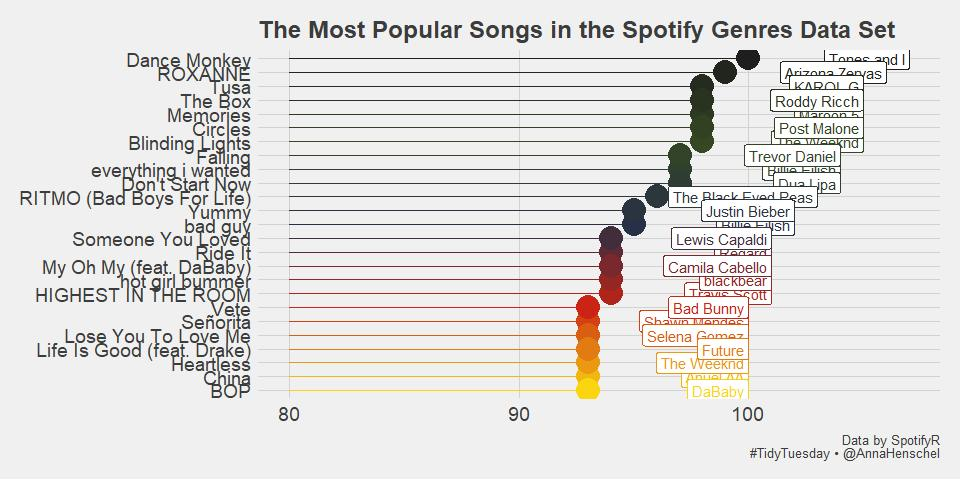

2020-01-21 Song Genres
================
Anna Henschel

## 2020 Week 4: Song Genres

Load libraries

``` r
library(forcats) # deal with reordering factor levels
library(wesanderson) # wes anderson colour palette
library(ggthemes) # pretty ggplot themes
library(tidyverse) # tidy data wrangling
```

Load data

``` r
spotify_songs <- readr::read_csv('https://raw.githubusercontent.com/rfordatascience/tidytuesday/master/data/2020/2020-01-21/spotify_songs.csv')
```

    ## Parsed with column specification:
    ## cols(
    ##   .default = col_double(),
    ##   track_id = col_character(),
    ##   track_name = col_character(),
    ##   track_artist = col_character(),
    ##   track_album_id = col_character(),
    ##   track_album_name = col_character(),
    ##   track_album_release_date = col_character(),
    ##   playlist_name = col_character(),
    ##   playlist_id = col_character(),
    ##   playlist_genre = col_character(),
    ##   playlist_subgenre = col_character()
    ## )

    ## See spec(...) for full column specifications.

``` r
glimpse(spotify_songs)
```

    ## Observations: 32,833
    ## Variables: 23
    ## $ track_id                 <chr> "6f807x0ima9a1j3VPbc7VN", "0r7CVbZTWZgbTCY...
    ## $ track_name               <chr> "I Don't Care (with Justin Bieber) - Loud ...
    ## $ track_artist             <chr> "Ed Sheeran", "Maroon 5", "Zara Larsson", ...
    ## $ track_popularity         <dbl> 66, 67, 70, 60, 69, 67, 62, 69, 68, 67, 58...
    ## $ track_album_id           <chr> "2oCs0DGTsRO98Gh5ZSl2Cx", "63rPSO264uRjW1X...
    ## $ track_album_name         <chr> "I Don't Care (with Justin Bieber) [Loud L...
    ## $ track_album_release_date <chr> "2019-06-14", "2019-12-13", "2019-07-05", ...
    ## $ playlist_name            <chr> "Pop Remix", "Pop Remix", "Pop Remix", "Po...
    ## $ playlist_id              <chr> "37i9dQZF1DXcZDD7cfEKhW", "37i9dQZF1DXcZDD...
    ## $ playlist_genre           <chr> "pop", "pop", "pop", "pop", "pop", "pop", ...
    ## $ playlist_subgenre        <chr> "dance pop", "dance pop", "dance pop", "da...
    ## $ danceability             <dbl> 0.748, 0.726, 0.675, 0.718, 0.650, 0.675, ...
    ## $ energy                   <dbl> 0.916, 0.815, 0.931, 0.930, 0.833, 0.919, ...
    ## $ key                      <dbl> 6, 11, 1, 7, 1, 8, 5, 4, 8, 2, 6, 8, 1, 5,...
    ## $ loudness                 <dbl> -2.634, -4.969, -3.432, -3.778, -4.672, -5...
    ## $ mode                     <dbl> 1, 1, 0, 1, 1, 1, 0, 0, 1, 1, 1, 1, 1, 0, ...
    ## $ speechiness              <dbl> 0.0583, 0.0373, 0.0742, 0.1020, 0.0359, 0....
    ## $ acousticness             <dbl> 0.10200, 0.07240, 0.07940, 0.02870, 0.0803...
    ## $ instrumentalness         <dbl> 0.00e+00, 4.21e-03, 2.33e-05, 9.43e-06, 0....
    ## $ liveness                 <dbl> 0.0653, 0.3570, 0.1100, 0.2040, 0.0833, 0....
    ## $ valence                  <dbl> 0.518, 0.693, 0.613, 0.277, 0.725, 0.585, ...
    ## $ tempo                    <dbl> 122.036, 99.972, 124.008, 121.956, 123.976...
    ## $ duration_ms              <dbl> 194754, 162600, 176616, 169093, 189052, 16...

#### What are the most popular songs?

Set up custom palette:

``` r
pal <- wes_palette("BottleRocket2", 25, type = "continuous") # set up colour palette
```

Find out what the most popular songs are in the Spotify Genres data set:

``` r
top_20 <- spotify_songs %>% 
  select(track_name, track_popularity, track_artist) %>%
  unique() %>%
  arrange(desc(track_popularity)) %>% 
  top_n(20, track_popularity) 
```

Show table:

``` r
knitr::kable(top_20)
```

| track\_name                | track\_popularity | track\_artist       |
| :------------------------- | ----------------: | :------------------ |
| Dance Monkey               |               100 | Tones and I         |
| ROXANNE                    |                99 | Arizona Zervas      |
| Tusa                       |                98 | KAROL G             |
| Memories                   |                98 | Maroon 5            |
| Blinding Lights            |                98 | The Weeknd          |
| Circles                    |                98 | Post Malone         |
| The Box                    |                98 | Roddy Ricch         |
| everything i wanted        |                97 | Billie Eilish       |
| Don’t Start Now            |                97 | Dua Lipa            |
| Falling                    |                97 | Trevor Daniel       |
| RITMO (Bad Boys For Life)  |                96 | The Black Eyed Peas |
| bad guy                    |                95 | Billie Eilish       |
| Yummy                      |                95 | Justin Bieber       |
| Ride It                    |                94 | Regard              |
| Someone You Loved          |                94 | Lewis Capaldi       |
| HIGHEST IN THE ROOM        |                94 | Travis Scott        |
| hot girl bummer            |                94 | blackbear           |
| My Oh My (feat. DaBaby)    |                94 | Camila Cabello      |
| China                      |                93 | Anuel AA            |
| Señorita                   |                93 | Shawn Mendes        |
| Heartless                  |                93 | The Weeknd          |
| Lose You To Love Me        |                93 | Selena Gomez        |
| Life Is Good (feat. Drake) |                93 | Future              |
| BOP                        |                93 | DaBaby              |
| Vete                       |                93 | Bad Bunny           |

Plot the most popular songs:

``` r
top_20 %>%
  mutate(track_name = fct_reorder(track_name, track_popularity)) %>% # HOORAY THIS WORKS TO REORDER FACTOR LEVELS BY OTHER VARIABLE!!
ggplot(aes(x = track_popularity, y = track_name, colour = track_name, label = track_artist)) + 
  geom_segment(aes(x = 80, y = track_name, xend = track_popularity, yend = track_name)) +
  geom_point(size = 8) +
  geom_label(nudge_x = 7, 
             hjust = "right") + 
  scale_colour_manual(values = pal) +
  theme_fivethirtyeight() + 
  theme(legend.position = "none", 
        axis.text.x = element_text(size =14), 
        axis.text.y = element_text(size =14)) +
  labs(x = 'Song Popularity', y = '',
         title = 'The Most Popular Songs in the Spotify Genres Data Set', 
         caption = 'Data by SpotifyR\n #TidyTuesday • @AnnaHenschel') 
```

<!-- -->

Post that helped me figure out how to reorder factor levels with the
{forcats} package:
<https://www.r-graph-gallery.com/267-reorder-a-variable-in-ggplot2.html>

Other things I learned is that RMarkdown lets me knit to “github
document”, which “generates \[a\] GitHub compatible markdown (.md) files
which are subsequently rendered to HTML when viewed on GitHub”. More
here: <https://rmarkdown.rstudio.com/github_document_format.html>
