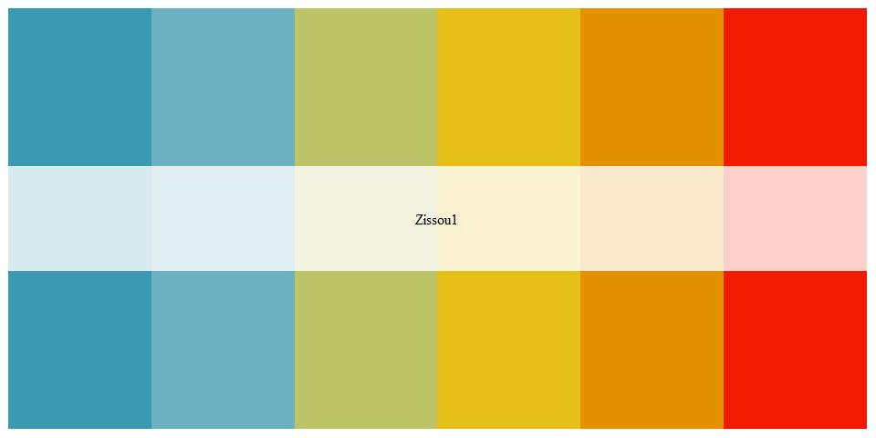
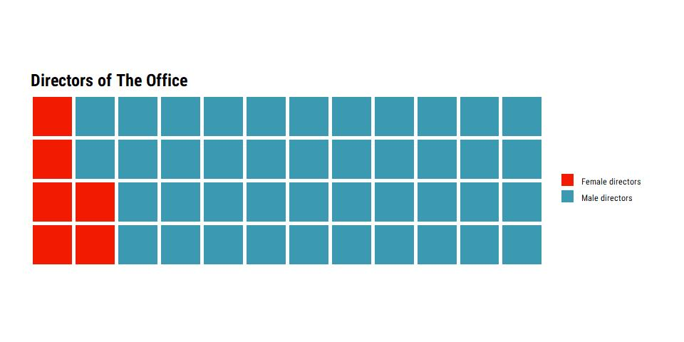
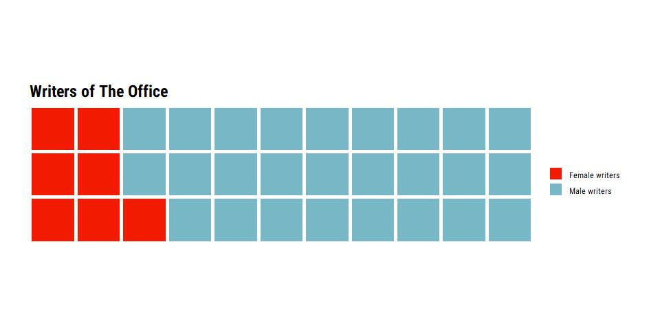
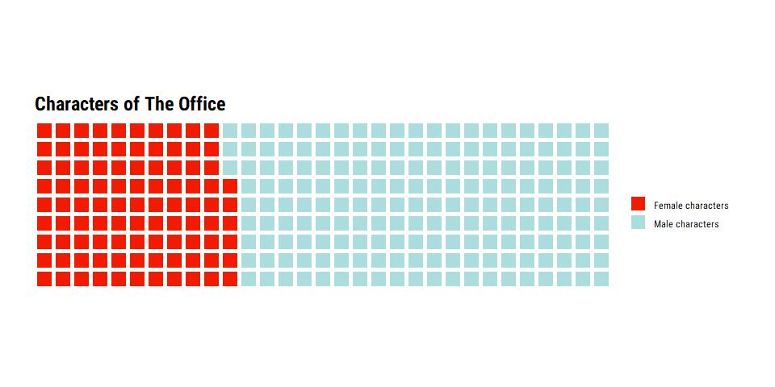
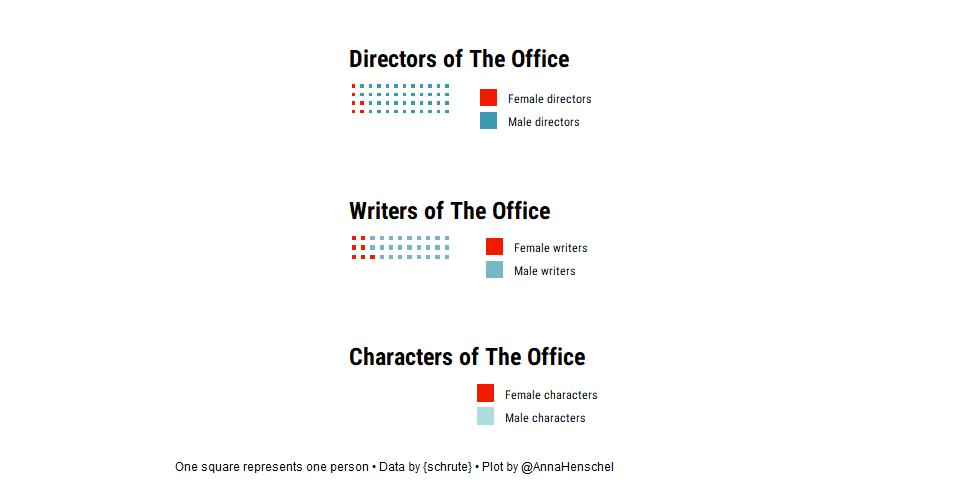

2020-03-17 The Office
================
Anna Henschel

``` r
library(schrute)
library(gender)
```

    ## PLEASE NOTE: The method provided by this package must be used cautiously
    ## and responsibly. Please be sure to see the guidelines and warnings about
    ## usage in the README or the package documentation.

``` r
library(janitor)
```

    ## 
    ## Attaching package: 'janitor'

    ## The following objects are masked from 'package:stats':
    ## 
    ##     chisq.test, fisher.test

``` r
library(waffle)
```

    ## Loading required package: ggplot2

``` r
library(hrbrthemes)
library(ggsci)
library(wesanderson)
library(extrafont)
```

    ## Registering fonts with R

``` r
library(patchwork)
library(tidyverse)
```

    ## -- Attaching packages -------------------------- tidyverse 1.3.0 --

    ## v tibble  2.1.3     v dplyr   0.8.4
    ## v tidyr   1.0.2     v stringr 1.4.0
    ## v readr   1.3.1     v forcats 0.5.0
    ## v purrr   0.3.3

    ## -- Conflicts ----------------------------- tidyverse_conflicts() --
    ## x dplyr::filter() masks stats::filter()
    ## x dplyr::lag()    masks stats::lag()

``` r
# IMDB ratings data
office_ratings <- readr::read_csv('https://raw.githubusercontent.com/rfordatascience/tidytuesday/master/data/2020/2020-03-17/office_ratings.csv')
```

    ## Parsed with column specification:
    ## cols(
    ##   season = col_double(),
    ##   episode = col_double(),
    ##   title = col_character(),
    ##   imdb_rating = col_double(),
    ##   total_votes = col_double(),
    ##   air_date = col_date(format = "")
    ## )

``` r
# Dialogue data
office_dialogues <- schrute::theoffice
```

``` r
# What gender are The Office episode directors?

# separate into first and last name
director_names <- office_dialogues %>%
  separate(director, c("first_name", "last_name"), " ") 
```

    ## Warning: Expected 2 pieces. Additional pieces discarded in 1721 rows [5103,
    ## 5104, 5105, 5106, 5107, 5108, 5109, 5110, 5111, 5112, 5113, 5114, 5115, 5116,
    ## 5117, 5118, 5119, 5120, 5121, 5122, ...].

``` r
# save as vector
director_names <- unique(director_names$first_name)

# Predict the gender of the directors
gender_directors <- gender(director_names)

# frequency table 
freq_gender <- gender_directors %>%
  tabyl(gender)
```

``` r
pal <- wes_palette("Zissou1", 6, type = "continuous")
pal
```

<!-- -->

``` r
parts <- c("Female directors" = 6, "Male directors" = 42)
p1 <- waffle::waffle(parts, 
               rows = 4,
               colors = c("#F21A00", "#3B9AB2"),
               legend_pos = "bottom", 
               title = "Directors of The Office") +
   theme_ipsum_rc() + 
    theme(axis.title.x=element_blank(),
        axis.text.x=element_blank(),
        axis.ticks.x=element_blank(), 
        axis.title.y=element_blank(),
        axis.text.y=element_blank(),
        axis.ticks.y=element_blank())
p1
```

    ## Warning in grid.Call(C_stringMetric, as.graphicsAnnot(x$label)): font family
    ## 'Roboto Condensed' not found in PostScript font database
    
    ## Warning in grid.Call(C_stringMetric, as.graphicsAnnot(x$label)): font family
    ## 'Roboto Condensed' not found in PostScript font database
    
    ## Warning in grid.Call(C_stringMetric, as.graphicsAnnot(x$label)): font family
    ## 'Roboto Condensed' not found in PostScript font database
    
    ## Warning in grid.Call(C_stringMetric, as.graphicsAnnot(x$label)): font family
    ## 'Roboto Condensed' not found in PostScript font database
    
    ## Warning in grid.Call(C_stringMetric, as.graphicsAnnot(x$label)): font family
    ## 'Roboto Condensed' not found in PostScript font database
    
    ## Warning in grid.Call(C_stringMetric, as.graphicsAnnot(x$label)): font family
    ## 'Roboto Condensed' not found in PostScript font database
    
    ## Warning in grid.Call(C_stringMetric, as.graphicsAnnot(x$label)): font family
    ## 'Roboto Condensed' not found in PostScript font database
    
    ## Warning in grid.Call(C_stringMetric, as.graphicsAnnot(x$label)): font family
    ## 'Roboto Condensed' not found in PostScript font database
    
    ## Warning in grid.Call(C_stringMetric, as.graphicsAnnot(x$label)): font family
    ## 'Roboto Condensed' not found in PostScript font database
    
    ## Warning in grid.Call(C_stringMetric, as.graphicsAnnot(x$label)): font family
    ## 'Roboto Condensed' not found in PostScript font database
    
    ## Warning in grid.Call(C_stringMetric, as.graphicsAnnot(x$label)): font family
    ## 'Roboto Condensed' not found in PostScript font database
    
    ## Warning in grid.Call(C_stringMetric, as.graphicsAnnot(x$label)): font family
    ## 'Roboto Condensed' not found in PostScript font database
    
    ## Warning in grid.Call(C_stringMetric, as.graphicsAnnot(x$label)): font family
    ## 'Roboto Condensed' not found in PostScript font database
    
    ## Warning in grid.Call(C_stringMetric, as.graphicsAnnot(x$label)): font family
    ## 'Roboto Condensed' not found in PostScript font database
    
    ## Warning in grid.Call(C_stringMetric, as.graphicsAnnot(x$label)): font family
    ## 'Roboto Condensed' not found in PostScript font database
    
    ## Warning in grid.Call(C_stringMetric, as.graphicsAnnot(x$label)): font family
    ## 'Roboto Condensed' not found in PostScript font database
    
    ## Warning in grid.Call(C_stringMetric, as.graphicsAnnot(x$label)): font family
    ## 'Roboto Condensed' not found in PostScript font database
    
    ## Warning in grid.Call(C_stringMetric, as.graphicsAnnot(x$label)): font family
    ## 'Roboto Condensed' not found in PostScript font database
    
    ## Warning in grid.Call(C_stringMetric, as.graphicsAnnot(x$label)): font family
    ## 'Roboto Condensed' not found in PostScript font database
    
    ## Warning in grid.Call(C_stringMetric, as.graphicsAnnot(x$label)): font family
    ## 'Roboto Condensed' not found in PostScript font database
    
    ## Warning in grid.Call(C_stringMetric, as.graphicsAnnot(x$label)): font family
    ## 'Roboto Condensed' not found in PostScript font database
    
    ## Warning in grid.Call(C_stringMetric, as.graphicsAnnot(x$label)): font family
    ## 'Roboto Condensed' not found in PostScript font database
    
    ## Warning in grid.Call(C_stringMetric, as.graphicsAnnot(x$label)): font family
    ## 'Roboto Condensed' not found in PostScript font database
    
    ## Warning in grid.Call(C_stringMetric, as.graphicsAnnot(x$label)): font family
    ## 'Roboto Condensed' not found in PostScript font database
    
    ## Warning in grid.Call(C_stringMetric, as.graphicsAnnot(x$label)): font family
    ## 'Roboto Condensed' not found in PostScript font database
    
    ## Warning in grid.Call(C_stringMetric, as.graphicsAnnot(x$label)): font family
    ## 'Roboto Condensed' not found in PostScript font database
    
    ## Warning in grid.Call(C_stringMetric, as.graphicsAnnot(x$label)): font family
    ## 'Roboto Condensed' not found in PostScript font database
    
    ## Warning in grid.Call(C_stringMetric, as.graphicsAnnot(x$label)): font family
    ## 'Roboto Condensed' not found in PostScript font database

    ## Warning in grid.Call(C_textBounds, as.graphicsAnnot(x$label), x$x, x$y, : font
    ## family 'Roboto Condensed' not found in PostScript font database
    
    ## Warning in grid.Call(C_textBounds, as.graphicsAnnot(x$label), x$x, x$y, : font
    ## family 'Roboto Condensed' not found in PostScript font database
    
    ## Warning in grid.Call(C_textBounds, as.graphicsAnnot(x$label), x$x, x$y, : font
    ## family 'Roboto Condensed' not found in PostScript font database
    
    ## Warning in grid.Call(C_textBounds, as.graphicsAnnot(x$label), x$x, x$y, : font
    ## family 'Roboto Condensed' not found in PostScript font database
    
    ## Warning in grid.Call(C_textBounds, as.graphicsAnnot(x$label), x$x, x$y, : font
    ## family 'Roboto Condensed' not found in PostScript font database
    
    ## Warning in grid.Call(C_textBounds, as.graphicsAnnot(x$label), x$x, x$y, : font
    ## family 'Roboto Condensed' not found in PostScript font database
    
    ## Warning in grid.Call(C_textBounds, as.graphicsAnnot(x$label), x$x, x$y, : font
    ## family 'Roboto Condensed' not found in PostScript font database
    
    ## Warning in grid.Call(C_textBounds, as.graphicsAnnot(x$label), x$x, x$y, : font
    ## family 'Roboto Condensed' not found in PostScript font database
    
    ## Warning in grid.Call(C_textBounds, as.graphicsAnnot(x$label), x$x, x$y, : font
    ## family 'Roboto Condensed' not found in PostScript font database
    
    ## Warning in grid.Call(C_textBounds, as.graphicsAnnot(x$label), x$x, x$y, : font
    ## family 'Roboto Condensed' not found in PostScript font database
    
    ## Warning in grid.Call(C_textBounds, as.graphicsAnnot(x$label), x$x, x$y, : font
    ## family 'Roboto Condensed' not found in PostScript font database
    
    ## Warning in grid.Call(C_textBounds, as.graphicsAnnot(x$label), x$x, x$y, : font
    ## family 'Roboto Condensed' not found in PostScript font database
    
    ## Warning in grid.Call(C_textBounds, as.graphicsAnnot(x$label), x$x, x$y, : font
    ## family 'Roboto Condensed' not found in PostScript font database
    
    ## Warning in grid.Call(C_textBounds, as.graphicsAnnot(x$label), x$x, x$y, : font
    ## family 'Roboto Condensed' not found in PostScript font database
    
    ## Warning in grid.Call(C_textBounds, as.graphicsAnnot(x$label), x$x, x$y, : font
    ## family 'Roboto Condensed' not found in PostScript font database
    
    ## Warning in grid.Call(C_textBounds, as.graphicsAnnot(x$label), x$x, x$y, : font
    ## family 'Roboto Condensed' not found in PostScript font database
    
    ## Warning in grid.Call(C_textBounds, as.graphicsAnnot(x$label), x$x, x$y, : font
    ## family 'Roboto Condensed' not found in PostScript font database
    
    ## Warning in grid.Call(C_textBounds, as.graphicsAnnot(x$label), x$x, x$y, : font
    ## family 'Roboto Condensed' not found in PostScript font database
    
    ## Warning in grid.Call(C_textBounds, as.graphicsAnnot(x$label), x$x, x$y, : font
    ## family 'Roboto Condensed' not found in PostScript font database
    
    ## Warning in grid.Call(C_textBounds, as.graphicsAnnot(x$label), x$x, x$y, : font
    ## family 'Roboto Condensed' not found in PostScript font database

    ## Warning in grid.Call(C_stringMetric, as.graphicsAnnot(x$label)): font family
    ## 'Roboto Condensed' not found in PostScript font database
    
    ## Warning in grid.Call(C_stringMetric, as.graphicsAnnot(x$label)): font family
    ## 'Roboto Condensed' not found in PostScript font database
    
    ## Warning in grid.Call(C_stringMetric, as.graphicsAnnot(x$label)): font family
    ## 'Roboto Condensed' not found in PostScript font database
    
    ## Warning in grid.Call(C_stringMetric, as.graphicsAnnot(x$label)): font family
    ## 'Roboto Condensed' not found in PostScript font database
    
    ## Warning in grid.Call(C_stringMetric, as.graphicsAnnot(x$label)): font family
    ## 'Roboto Condensed' not found in PostScript font database
    
    ## Warning in grid.Call(C_stringMetric, as.graphicsAnnot(x$label)): font family
    ## 'Roboto Condensed' not found in PostScript font database
    
    ## Warning in grid.Call(C_stringMetric, as.graphicsAnnot(x$label)): font family
    ## 'Roboto Condensed' not found in PostScript font database
    
    ## Warning in grid.Call(C_stringMetric, as.graphicsAnnot(x$label)): font family
    ## 'Roboto Condensed' not found in PostScript font database
    
    ## Warning in grid.Call(C_stringMetric, as.graphicsAnnot(x$label)): font family
    ## 'Roboto Condensed' not found in PostScript font database
    
    ## Warning in grid.Call(C_stringMetric, as.graphicsAnnot(x$label)): font family
    ## 'Roboto Condensed' not found in PostScript font database
    
    ## Warning in grid.Call(C_stringMetric, as.graphicsAnnot(x$label)): font family
    ## 'Roboto Condensed' not found in PostScript font database
    
    ## Warning in grid.Call(C_stringMetric, as.graphicsAnnot(x$label)): font family
    ## 'Roboto Condensed' not found in PostScript font database
    
    ## Warning in grid.Call(C_stringMetric, as.graphicsAnnot(x$label)): font family
    ## 'Roboto Condensed' not found in PostScript font database
    
    ## Warning in grid.Call(C_stringMetric, as.graphicsAnnot(x$label)): font family
    ## 'Roboto Condensed' not found in PostScript font database

    ## Warning in grid.Call(C_textBounds, as.graphicsAnnot(x$label), x$x, x$y, : font
    ## family 'Roboto Condensed' not found in PostScript font database
    
    ## Warning in grid.Call(C_textBounds, as.graphicsAnnot(x$label), x$x, x$y, : font
    ## family 'Roboto Condensed' not found in PostScript font database
    
    ## Warning in grid.Call(C_textBounds, as.graphicsAnnot(x$label), x$x, x$y, : font
    ## family 'Roboto Condensed' not found in PostScript font database
    
    ## Warning in grid.Call(C_textBounds, as.graphicsAnnot(x$label), x$x, x$y, : font
    ## family 'Roboto Condensed' not found in PostScript font database
    
    ## Warning in grid.Call(C_textBounds, as.graphicsAnnot(x$label), x$x, x$y, : font
    ## family 'Roboto Condensed' not found in PostScript font database
    
    ## Warning in grid.Call(C_textBounds, as.graphicsAnnot(x$label), x$x, x$y, : font
    ## family 'Roboto Condensed' not found in PostScript font database
    
    ## Warning in grid.Call(C_textBounds, as.graphicsAnnot(x$label), x$x, x$y, : font
    ## family 'Roboto Condensed' not found in PostScript font database
    
    ## Warning in grid.Call(C_textBounds, as.graphicsAnnot(x$label), x$x, x$y, : font
    ## family 'Roboto Condensed' not found in PostScript font database
    
    ## Warning in grid.Call(C_textBounds, as.graphicsAnnot(x$label), x$x, x$y, : font
    ## family 'Roboto Condensed' not found in PostScript font database
    
    ## Warning in grid.Call(C_textBounds, as.graphicsAnnot(x$label), x$x, x$y, : font
    ## family 'Roboto Condensed' not found in PostScript font database
    
    ## Warning in grid.Call(C_textBounds, as.graphicsAnnot(x$label), x$x, x$y, : font
    ## family 'Roboto Condensed' not found in PostScript font database
    
    ## Warning in grid.Call(C_textBounds, as.graphicsAnnot(x$label), x$x, x$y, : font
    ## family 'Roboto Condensed' not found in PostScript font database
    
    ## Warning in grid.Call(C_textBounds, as.graphicsAnnot(x$label), x$x, x$y, : font
    ## family 'Roboto Condensed' not found in PostScript font database
    
    ## Warning in grid.Call(C_textBounds, as.graphicsAnnot(x$label), x$x, x$y, : font
    ## family 'Roboto Condensed' not found in PostScript font database
    
    ## Warning in grid.Call(C_textBounds, as.graphicsAnnot(x$label), x$x, x$y, : font
    ## family 'Roboto Condensed' not found in PostScript font database
    
    ## Warning in grid.Call(C_textBounds, as.graphicsAnnot(x$label), x$x, x$y, : font
    ## family 'Roboto Condensed' not found in PostScript font database
    
    ## Warning in grid.Call(C_textBounds, as.graphicsAnnot(x$label), x$x, x$y, : font
    ## family 'Roboto Condensed' not found in PostScript font database
    
    ## Warning in grid.Call(C_textBounds, as.graphicsAnnot(x$label), x$x, x$y, : font
    ## family 'Roboto Condensed' not found in PostScript font database
    
    ## Warning in grid.Call(C_textBounds, as.graphicsAnnot(x$label), x$x, x$y, : font
    ## family 'Roboto Condensed' not found in PostScript font database
    
    ## Warning in grid.Call(C_textBounds, as.graphicsAnnot(x$label), x$x, x$y, : font
    ## family 'Roboto Condensed' not found in PostScript font database
    
    ## Warning in grid.Call(C_textBounds, as.graphicsAnnot(x$label), x$x, x$y, : font
    ## family 'Roboto Condensed' not found in PostScript font database
    
    ## Warning in grid.Call(C_textBounds, as.graphicsAnnot(x$label), x$x, x$y, : font
    ## family 'Roboto Condensed' not found in PostScript font database

    ## Warning in grid.Call.graphics(C_text, as.graphicsAnnot(x$label), x$x, x$y, :
    ## font family 'Roboto Condensed' not found in PostScript font database

    ## Warning in grid.Call(C_textBounds, as.graphicsAnnot(x$label), x$x, x$y, : font
    ## family 'Roboto Condensed' not found in PostScript font database
    
    ## Warning in grid.Call(C_textBounds, as.graphicsAnnot(x$label), x$x, x$y, : font
    ## family 'Roboto Condensed' not found in PostScript font database
    
    ## Warning in grid.Call(C_textBounds, as.graphicsAnnot(x$label), x$x, x$y, : font
    ## family 'Roboto Condensed' not found in PostScript font database
    
    ## Warning in grid.Call(C_textBounds, as.graphicsAnnot(x$label), x$x, x$y, : font
    ## family 'Roboto Condensed' not found in PostScript font database
    
    ## Warning in grid.Call(C_textBounds, as.graphicsAnnot(x$label), x$x, x$y, : font
    ## family 'Roboto Condensed' not found in PostScript font database
    
    ## Warning in grid.Call(C_textBounds, as.graphicsAnnot(x$label), x$x, x$y, : font
    ## family 'Roboto Condensed' not found in PostScript font database
    
    ## Warning in grid.Call(C_textBounds, as.graphicsAnnot(x$label), x$x, x$y, : font
    ## family 'Roboto Condensed' not found in PostScript font database
    
    ## Warning in grid.Call(C_textBounds, as.graphicsAnnot(x$label), x$x, x$y, : font
    ## family 'Roboto Condensed' not found in PostScript font database
    
    ## Warning in grid.Call(C_textBounds, as.graphicsAnnot(x$label), x$x, x$y, : font
    ## family 'Roboto Condensed' not found in PostScript font database
    
    ## Warning in grid.Call(C_textBounds, as.graphicsAnnot(x$label), x$x, x$y, : font
    ## family 'Roboto Condensed' not found in PostScript font database
    
    ## Warning in grid.Call(C_textBounds, as.graphicsAnnot(x$label), x$x, x$y, : font
    ## family 'Roboto Condensed' not found in PostScript font database
    
    ## Warning in grid.Call(C_textBounds, as.graphicsAnnot(x$label), x$x, x$y, : font
    ## family 'Roboto Condensed' not found in PostScript font database
    
    ## Warning in grid.Call(C_textBounds, as.graphicsAnnot(x$label), x$x, x$y, : font
    ## family 'Roboto Condensed' not found in PostScript font database
    
    ## Warning in grid.Call(C_textBounds, as.graphicsAnnot(x$label), x$x, x$y, : font
    ## family 'Roboto Condensed' not found in PostScript font database

    ## Warning in grid.Call.graphics(C_text, as.graphicsAnnot(x$label), x$x, x$y, :
    ## font family 'Roboto Condensed' not found in PostScript font database

    ## Warning in grid.Call(C_textBounds, as.graphicsAnnot(x$label), x$x, x$y, : font
    ## family 'Roboto Condensed' not found in PostScript font database
    
    ## Warning in grid.Call(C_textBounds, as.graphicsAnnot(x$label), x$x, x$y, : font
    ## family 'Roboto Condensed' not found in PostScript font database
    
    ## Warning in grid.Call(C_textBounds, as.graphicsAnnot(x$label), x$x, x$y, : font
    ## family 'Roboto Condensed' not found in PostScript font database

    ## Warning in grid.Call.graphics(C_text, as.graphicsAnnot(x$label), x$x, x$y, :
    ## font family 'Roboto Condensed' not found in PostScript font database

<!-- -->

``` r
# What gender are The Office episode directors?

# separate into first and last name
writer_names <- office_dialogues %>%
  separate(writer, c("first_name", "last_name"), " ") 
```

    ## Warning: Expected 2 pieces. Additional pieces discarded in 11148 rows [1, 2, 3,
    ## 4, 5, 6, 7, 8, 9, 10, 11, 12, 13, 14, 15, 16, 17, 18, 19, 20, ...].

``` r
# save as vector
writer_names <- unique(writer_names$first_name)

# Predict the gender of the directors
gender_writers <- gender(writer_names)

# frequency table 
freq_gender_2 <- gender_writers %>%
  tabyl(gender)
```

``` r
parts_2 <- c("Female writers" = 7, "Male writers" = 26)
p2 <- waffle::waffle(parts_2, 
               rows = 3,
               colors = c("#F21A00", "#78B7C5"),
               legend_pos = "bottom", 
               title = "Writers of The Office") + 
     theme_ipsum_rc() + 
    theme(axis.title.x=element_blank(),
        axis.text.x=element_blank(),
        axis.ticks.x=element_blank(), 
        axis.title.y=element_blank(),
        axis.text.y=element_blank(),
        axis.ticks.y=element_blank())
p2
```

    ## Warning in grid.Call(C_textBounds, as.graphicsAnnot(x$label), x$x, x$y, : font
    ## family 'Roboto Condensed' not found in PostScript font database
    
    ## Warning in grid.Call(C_textBounds, as.graphicsAnnot(x$label), x$x, x$y, : font
    ## family 'Roboto Condensed' not found in PostScript font database
    
    ## Warning in grid.Call(C_textBounds, as.graphicsAnnot(x$label), x$x, x$y, : font
    ## family 'Roboto Condensed' not found in PostScript font database
    
    ## Warning in grid.Call(C_textBounds, as.graphicsAnnot(x$label), x$x, x$y, : font
    ## family 'Roboto Condensed' not found in PostScript font database
    
    ## Warning in grid.Call(C_textBounds, as.graphicsAnnot(x$label), x$x, x$y, : font
    ## family 'Roboto Condensed' not found in PostScript font database
    
    ## Warning in grid.Call(C_textBounds, as.graphicsAnnot(x$label), x$x, x$y, : font
    ## family 'Roboto Condensed' not found in PostScript font database
    
    ## Warning in grid.Call(C_textBounds, as.graphicsAnnot(x$label), x$x, x$y, : font
    ## family 'Roboto Condensed' not found in PostScript font database
    
    ## Warning in grid.Call(C_textBounds, as.graphicsAnnot(x$label), x$x, x$y, : font
    ## family 'Roboto Condensed' not found in PostScript font database
    
    ## Warning in grid.Call(C_textBounds, as.graphicsAnnot(x$label), x$x, x$y, : font
    ## family 'Roboto Condensed' not found in PostScript font database
    
    ## Warning in grid.Call(C_textBounds, as.graphicsAnnot(x$label), x$x, x$y, : font
    ## family 'Roboto Condensed' not found in PostScript font database
    
    ## Warning in grid.Call(C_textBounds, as.graphicsAnnot(x$label), x$x, x$y, : font
    ## family 'Roboto Condensed' not found in PostScript font database
    
    ## Warning in grid.Call(C_textBounds, as.graphicsAnnot(x$label), x$x, x$y, : font
    ## family 'Roboto Condensed' not found in PostScript font database
    
    ## Warning in grid.Call(C_textBounds, as.graphicsAnnot(x$label), x$x, x$y, : font
    ## family 'Roboto Condensed' not found in PostScript font database
    
    ## Warning in grid.Call(C_textBounds, as.graphicsAnnot(x$label), x$x, x$y, : font
    ## family 'Roboto Condensed' not found in PostScript font database
    
    ## Warning in grid.Call(C_textBounds, as.graphicsAnnot(x$label), x$x, x$y, : font
    ## family 'Roboto Condensed' not found in PostScript font database
    
    ## Warning in grid.Call(C_textBounds, as.graphicsAnnot(x$label), x$x, x$y, : font
    ## family 'Roboto Condensed' not found in PostScript font database
    
    ## Warning in grid.Call(C_textBounds, as.graphicsAnnot(x$label), x$x, x$y, : font
    ## family 'Roboto Condensed' not found in PostScript font database
    
    ## Warning in grid.Call(C_textBounds, as.graphicsAnnot(x$label), x$x, x$y, : font
    ## family 'Roboto Condensed' not found in PostScript font database
    
    ## Warning in grid.Call(C_textBounds, as.graphicsAnnot(x$label), x$x, x$y, : font
    ## family 'Roboto Condensed' not found in PostScript font database
    
    ## Warning in grid.Call(C_textBounds, as.graphicsAnnot(x$label), x$x, x$y, : font
    ## family 'Roboto Condensed' not found in PostScript font database
    
    ## Warning in grid.Call(C_textBounds, as.graphicsAnnot(x$label), x$x, x$y, : font
    ## family 'Roboto Condensed' not found in PostScript font database
    
    ## Warning in grid.Call(C_textBounds, as.graphicsAnnot(x$label), x$x, x$y, : font
    ## family 'Roboto Condensed' not found in PostScript font database
    
    ## Warning in grid.Call(C_textBounds, as.graphicsAnnot(x$label), x$x, x$y, : font
    ## family 'Roboto Condensed' not found in PostScript font database
    
    ## Warning in grid.Call(C_textBounds, as.graphicsAnnot(x$label), x$x, x$y, : font
    ## family 'Roboto Condensed' not found in PostScript font database
    
    ## Warning in grid.Call(C_textBounds, as.graphicsAnnot(x$label), x$x, x$y, : font
    ## family 'Roboto Condensed' not found in PostScript font database
    
    ## Warning in grid.Call(C_textBounds, as.graphicsAnnot(x$label), x$x, x$y, : font
    ## family 'Roboto Condensed' not found in PostScript font database
    
    ## Warning in grid.Call(C_textBounds, as.graphicsAnnot(x$label), x$x, x$y, : font
    ## family 'Roboto Condensed' not found in PostScript font database
    
    ## Warning in grid.Call(C_textBounds, as.graphicsAnnot(x$label), x$x, x$y, : font
    ## family 'Roboto Condensed' not found in PostScript font database
    
    ## Warning in grid.Call(C_textBounds, as.graphicsAnnot(x$label), x$x, x$y, : font
    ## family 'Roboto Condensed' not found in PostScript font database
    
    ## Warning in grid.Call(C_textBounds, as.graphicsAnnot(x$label), x$x, x$y, : font
    ## family 'Roboto Condensed' not found in PostScript font database
    
    ## Warning in grid.Call(C_textBounds, as.graphicsAnnot(x$label), x$x, x$y, : font
    ## family 'Roboto Condensed' not found in PostScript font database
    
    ## Warning in grid.Call(C_textBounds, as.graphicsAnnot(x$label), x$x, x$y, : font
    ## family 'Roboto Condensed' not found in PostScript font database
    
    ## Warning in grid.Call(C_textBounds, as.graphicsAnnot(x$label), x$x, x$y, : font
    ## family 'Roboto Condensed' not found in PostScript font database
    
    ## Warning in grid.Call(C_textBounds, as.graphicsAnnot(x$label), x$x, x$y, : font
    ## family 'Roboto Condensed' not found in PostScript font database
    
    ## Warning in grid.Call(C_textBounds, as.graphicsAnnot(x$label), x$x, x$y, : font
    ## family 'Roboto Condensed' not found in PostScript font database
    
    ## Warning in grid.Call(C_textBounds, as.graphicsAnnot(x$label), x$x, x$y, : font
    ## family 'Roboto Condensed' not found in PostScript font database
    
    ## Warning in grid.Call(C_textBounds, as.graphicsAnnot(x$label), x$x, x$y, : font
    ## family 'Roboto Condensed' not found in PostScript font database
    
    ## Warning in grid.Call(C_textBounds, as.graphicsAnnot(x$label), x$x, x$y, : font
    ## family 'Roboto Condensed' not found in PostScript font database
    
    ## Warning in grid.Call(C_textBounds, as.graphicsAnnot(x$label), x$x, x$y, : font
    ## family 'Roboto Condensed' not found in PostScript font database
    
    ## Warning in grid.Call(C_textBounds, as.graphicsAnnot(x$label), x$x, x$y, : font
    ## family 'Roboto Condensed' not found in PostScript font database
    
    ## Warning in grid.Call(C_textBounds, as.graphicsAnnot(x$label), x$x, x$y, : font
    ## family 'Roboto Condensed' not found in PostScript font database
    
    ## Warning in grid.Call(C_textBounds, as.graphicsAnnot(x$label), x$x, x$y, : font
    ## family 'Roboto Condensed' not found in PostScript font database
    
    ## Warning in grid.Call(C_textBounds, as.graphicsAnnot(x$label), x$x, x$y, : font
    ## family 'Roboto Condensed' not found in PostScript font database
    
    ## Warning in grid.Call(C_textBounds, as.graphicsAnnot(x$label), x$x, x$y, : font
    ## family 'Roboto Condensed' not found in PostScript font database

    ## Warning in grid.Call.graphics(C_text, as.graphicsAnnot(x$label), x$x, x$y, :
    ## font family 'Roboto Condensed' not found in PostScript font database

    ## Warning in grid.Call(C_textBounds, as.graphicsAnnot(x$label), x$x, x$y, : font
    ## family 'Roboto Condensed' not found in PostScript font database
    
    ## Warning in grid.Call(C_textBounds, as.graphicsAnnot(x$label), x$x, x$y, : font
    ## family 'Roboto Condensed' not found in PostScript font database
    
    ## Warning in grid.Call(C_textBounds, as.graphicsAnnot(x$label), x$x, x$y, : font
    ## family 'Roboto Condensed' not found in PostScript font database
    
    ## Warning in grid.Call(C_textBounds, as.graphicsAnnot(x$label), x$x, x$y, : font
    ## family 'Roboto Condensed' not found in PostScript font database
    
    ## Warning in grid.Call(C_textBounds, as.graphicsAnnot(x$label), x$x, x$y, : font
    ## family 'Roboto Condensed' not found in PostScript font database
    
    ## Warning in grid.Call(C_textBounds, as.graphicsAnnot(x$label), x$x, x$y, : font
    ## family 'Roboto Condensed' not found in PostScript font database
    
    ## Warning in grid.Call(C_textBounds, as.graphicsAnnot(x$label), x$x, x$y, : font
    ## family 'Roboto Condensed' not found in PostScript font database
    
    ## Warning in grid.Call(C_textBounds, as.graphicsAnnot(x$label), x$x, x$y, : font
    ## family 'Roboto Condensed' not found in PostScript font database
    
    ## Warning in grid.Call(C_textBounds, as.graphicsAnnot(x$label), x$x, x$y, : font
    ## family 'Roboto Condensed' not found in PostScript font database
    
    ## Warning in grid.Call(C_textBounds, as.graphicsAnnot(x$label), x$x, x$y, : font
    ## family 'Roboto Condensed' not found in PostScript font database
    
    ## Warning in grid.Call(C_textBounds, as.graphicsAnnot(x$label), x$x, x$y, : font
    ## family 'Roboto Condensed' not found in PostScript font database
    
    ## Warning in grid.Call(C_textBounds, as.graphicsAnnot(x$label), x$x, x$y, : font
    ## family 'Roboto Condensed' not found in PostScript font database
    
    ## Warning in grid.Call(C_textBounds, as.graphicsAnnot(x$label), x$x, x$y, : font
    ## family 'Roboto Condensed' not found in PostScript font database
    
    ## Warning in grid.Call(C_textBounds, as.graphicsAnnot(x$label), x$x, x$y, : font
    ## family 'Roboto Condensed' not found in PostScript font database

    ## Warning in grid.Call.graphics(C_text, as.graphicsAnnot(x$label), x$x, x$y, :
    ## font family 'Roboto Condensed' not found in PostScript font database

    ## Warning in grid.Call(C_textBounds, as.graphicsAnnot(x$label), x$x, x$y, : font
    ## family 'Roboto Condensed' not found in PostScript font database
    
    ## Warning in grid.Call(C_textBounds, as.graphicsAnnot(x$label), x$x, x$y, : font
    ## family 'Roboto Condensed' not found in PostScript font database
    
    ## Warning in grid.Call(C_textBounds, as.graphicsAnnot(x$label), x$x, x$y, : font
    ## family 'Roboto Condensed' not found in PostScript font database

    ## Warning in grid.Call.graphics(C_text, as.graphicsAnnot(x$label), x$x, x$y, :
    ## font family 'Roboto Condensed' not found in PostScript font database

<!-- -->

``` r
# What gender are The Office episode characters?

# separate into first and last name
character_names <- office_dialogues %>%
  separate(character, c("first_name", "last_name"), " ") 
```

    ## Warning: Expected 2 pieces. Additional pieces discarded in 369 rows [562, 564,
    ## 566, 1063, 1719, 1721, 1723, 1726, 1735, 1952, 2383, 2391, 2395, 3325, 3368,
    ## 3711, 3715, 3719, 3748, 3752, ...].

    ## Warning: Expected 2 pieces. Missing pieces filled with `NA` in 53691 rows [1, 2,
    ## 3, 4, 5, 6, 7, 8, 9, 10, 11, 12, 13, 14, 15, 16, 17, 18, 19, 20, ...].

``` r
character_names <- unique(character_names$first_name)

# Predict the gender of the directors
gender_characters <- gender(character_names)

# frequency table 
freq_gender_3 <- gender_characters %>%
  tabyl(gender)
```

``` r
parts_3 <- c("Female characters" = 96, "Male characters" = 183)
p3 <- waffle::waffle(parts_3, 
               rows = 9,
               colors = c("#F21A00", "#ABDDDE"),
               legend_pos = "bottom", 
               title = "Characters of The Office") +
       theme_ipsum_rc() + 
    theme(axis.title.x=element_blank(),
        axis.text.x=element_blank(),
        axis.ticks.x=element_blank(), 
        axis.title.y=element_blank(),
        axis.text.y=element_blank(),
        axis.ticks.y=element_blank())
p3
```

    ## Warning in grid.Call(C_textBounds, as.graphicsAnnot(x$label), x$x, x$y, : font
    ## family 'Roboto Condensed' not found in PostScript font database
    
    ## Warning in grid.Call(C_textBounds, as.graphicsAnnot(x$label), x$x, x$y, : font
    ## family 'Roboto Condensed' not found in PostScript font database
    
    ## Warning in grid.Call(C_textBounds, as.graphicsAnnot(x$label), x$x, x$y, : font
    ## family 'Roboto Condensed' not found in PostScript font database
    
    ## Warning in grid.Call(C_textBounds, as.graphicsAnnot(x$label), x$x, x$y, : font
    ## family 'Roboto Condensed' not found in PostScript font database
    
    ## Warning in grid.Call(C_textBounds, as.graphicsAnnot(x$label), x$x, x$y, : font
    ## family 'Roboto Condensed' not found in PostScript font database
    
    ## Warning in grid.Call(C_textBounds, as.graphicsAnnot(x$label), x$x, x$y, : font
    ## family 'Roboto Condensed' not found in PostScript font database
    
    ## Warning in grid.Call(C_textBounds, as.graphicsAnnot(x$label), x$x, x$y, : font
    ## family 'Roboto Condensed' not found in PostScript font database
    
    ## Warning in grid.Call(C_textBounds, as.graphicsAnnot(x$label), x$x, x$y, : font
    ## family 'Roboto Condensed' not found in PostScript font database
    
    ## Warning in grid.Call(C_textBounds, as.graphicsAnnot(x$label), x$x, x$y, : font
    ## family 'Roboto Condensed' not found in PostScript font database
    
    ## Warning in grid.Call(C_textBounds, as.graphicsAnnot(x$label), x$x, x$y, : font
    ## family 'Roboto Condensed' not found in PostScript font database
    
    ## Warning in grid.Call(C_textBounds, as.graphicsAnnot(x$label), x$x, x$y, : font
    ## family 'Roboto Condensed' not found in PostScript font database
    
    ## Warning in grid.Call(C_textBounds, as.graphicsAnnot(x$label), x$x, x$y, : font
    ## family 'Roboto Condensed' not found in PostScript font database
    
    ## Warning in grid.Call(C_textBounds, as.graphicsAnnot(x$label), x$x, x$y, : font
    ## family 'Roboto Condensed' not found in PostScript font database
    
    ## Warning in grid.Call(C_textBounds, as.graphicsAnnot(x$label), x$x, x$y, : font
    ## family 'Roboto Condensed' not found in PostScript font database
    
    ## Warning in grid.Call(C_textBounds, as.graphicsAnnot(x$label), x$x, x$y, : font
    ## family 'Roboto Condensed' not found in PostScript font database
    
    ## Warning in grid.Call(C_textBounds, as.graphicsAnnot(x$label), x$x, x$y, : font
    ## family 'Roboto Condensed' not found in PostScript font database
    
    ## Warning in grid.Call(C_textBounds, as.graphicsAnnot(x$label), x$x, x$y, : font
    ## family 'Roboto Condensed' not found in PostScript font database
    
    ## Warning in grid.Call(C_textBounds, as.graphicsAnnot(x$label), x$x, x$y, : font
    ## family 'Roboto Condensed' not found in PostScript font database
    
    ## Warning in grid.Call(C_textBounds, as.graphicsAnnot(x$label), x$x, x$y, : font
    ## family 'Roboto Condensed' not found in PostScript font database
    
    ## Warning in grid.Call(C_textBounds, as.graphicsAnnot(x$label), x$x, x$y, : font
    ## family 'Roboto Condensed' not found in PostScript font database
    
    ## Warning in grid.Call(C_textBounds, as.graphicsAnnot(x$label), x$x, x$y, : font
    ## family 'Roboto Condensed' not found in PostScript font database
    
    ## Warning in grid.Call(C_textBounds, as.graphicsAnnot(x$label), x$x, x$y, : font
    ## family 'Roboto Condensed' not found in PostScript font database
    
    ## Warning in grid.Call(C_textBounds, as.graphicsAnnot(x$label), x$x, x$y, : font
    ## family 'Roboto Condensed' not found in PostScript font database
    
    ## Warning in grid.Call(C_textBounds, as.graphicsAnnot(x$label), x$x, x$y, : font
    ## family 'Roboto Condensed' not found in PostScript font database
    
    ## Warning in grid.Call(C_textBounds, as.graphicsAnnot(x$label), x$x, x$y, : font
    ## family 'Roboto Condensed' not found in PostScript font database
    
    ## Warning in grid.Call(C_textBounds, as.graphicsAnnot(x$label), x$x, x$y, : font
    ## family 'Roboto Condensed' not found in PostScript font database
    
    ## Warning in grid.Call(C_textBounds, as.graphicsAnnot(x$label), x$x, x$y, : font
    ## family 'Roboto Condensed' not found in PostScript font database
    
    ## Warning in grid.Call(C_textBounds, as.graphicsAnnot(x$label), x$x, x$y, : font
    ## family 'Roboto Condensed' not found in PostScript font database
    
    ## Warning in grid.Call(C_textBounds, as.graphicsAnnot(x$label), x$x, x$y, : font
    ## family 'Roboto Condensed' not found in PostScript font database
    
    ## Warning in grid.Call(C_textBounds, as.graphicsAnnot(x$label), x$x, x$y, : font
    ## family 'Roboto Condensed' not found in PostScript font database
    
    ## Warning in grid.Call(C_textBounds, as.graphicsAnnot(x$label), x$x, x$y, : font
    ## family 'Roboto Condensed' not found in PostScript font database
    
    ## Warning in grid.Call(C_textBounds, as.graphicsAnnot(x$label), x$x, x$y, : font
    ## family 'Roboto Condensed' not found in PostScript font database
    
    ## Warning in grid.Call(C_textBounds, as.graphicsAnnot(x$label), x$x, x$y, : font
    ## family 'Roboto Condensed' not found in PostScript font database
    
    ## Warning in grid.Call(C_textBounds, as.graphicsAnnot(x$label), x$x, x$y, : font
    ## family 'Roboto Condensed' not found in PostScript font database
    
    ## Warning in grid.Call(C_textBounds, as.graphicsAnnot(x$label), x$x, x$y, : font
    ## family 'Roboto Condensed' not found in PostScript font database
    
    ## Warning in grid.Call(C_textBounds, as.graphicsAnnot(x$label), x$x, x$y, : font
    ## family 'Roboto Condensed' not found in PostScript font database
    
    ## Warning in grid.Call(C_textBounds, as.graphicsAnnot(x$label), x$x, x$y, : font
    ## family 'Roboto Condensed' not found in PostScript font database
    
    ## Warning in grid.Call(C_textBounds, as.graphicsAnnot(x$label), x$x, x$y, : font
    ## family 'Roboto Condensed' not found in PostScript font database
    
    ## Warning in grid.Call(C_textBounds, as.graphicsAnnot(x$label), x$x, x$y, : font
    ## family 'Roboto Condensed' not found in PostScript font database
    
    ## Warning in grid.Call(C_textBounds, as.graphicsAnnot(x$label), x$x, x$y, : font
    ## family 'Roboto Condensed' not found in PostScript font database
    
    ## Warning in grid.Call(C_textBounds, as.graphicsAnnot(x$label), x$x, x$y, : font
    ## family 'Roboto Condensed' not found in PostScript font database
    
    ## Warning in grid.Call(C_textBounds, as.graphicsAnnot(x$label), x$x, x$y, : font
    ## family 'Roboto Condensed' not found in PostScript font database
    
    ## Warning in grid.Call(C_textBounds, as.graphicsAnnot(x$label), x$x, x$y, : font
    ## family 'Roboto Condensed' not found in PostScript font database
    
    ## Warning in grid.Call(C_textBounds, as.graphicsAnnot(x$label), x$x, x$y, : font
    ## family 'Roboto Condensed' not found in PostScript font database

    ## Warning in grid.Call.graphics(C_text, as.graphicsAnnot(x$label), x$x, x$y, :
    ## font family 'Roboto Condensed' not found in PostScript font database

    ## Warning in grid.Call(C_textBounds, as.graphicsAnnot(x$label), x$x, x$y, : font
    ## family 'Roboto Condensed' not found in PostScript font database
    
    ## Warning in grid.Call(C_textBounds, as.graphicsAnnot(x$label), x$x, x$y, : font
    ## family 'Roboto Condensed' not found in PostScript font database
    
    ## Warning in grid.Call(C_textBounds, as.graphicsAnnot(x$label), x$x, x$y, : font
    ## family 'Roboto Condensed' not found in PostScript font database
    
    ## Warning in grid.Call(C_textBounds, as.graphicsAnnot(x$label), x$x, x$y, : font
    ## family 'Roboto Condensed' not found in PostScript font database
    
    ## Warning in grid.Call(C_textBounds, as.graphicsAnnot(x$label), x$x, x$y, : font
    ## family 'Roboto Condensed' not found in PostScript font database
    
    ## Warning in grid.Call(C_textBounds, as.graphicsAnnot(x$label), x$x, x$y, : font
    ## family 'Roboto Condensed' not found in PostScript font database
    
    ## Warning in grid.Call(C_textBounds, as.graphicsAnnot(x$label), x$x, x$y, : font
    ## family 'Roboto Condensed' not found in PostScript font database
    
    ## Warning in grid.Call(C_textBounds, as.graphicsAnnot(x$label), x$x, x$y, : font
    ## family 'Roboto Condensed' not found in PostScript font database
    
    ## Warning in grid.Call(C_textBounds, as.graphicsAnnot(x$label), x$x, x$y, : font
    ## family 'Roboto Condensed' not found in PostScript font database
    
    ## Warning in grid.Call(C_textBounds, as.graphicsAnnot(x$label), x$x, x$y, : font
    ## family 'Roboto Condensed' not found in PostScript font database
    
    ## Warning in grid.Call(C_textBounds, as.graphicsAnnot(x$label), x$x, x$y, : font
    ## family 'Roboto Condensed' not found in PostScript font database
    
    ## Warning in grid.Call(C_textBounds, as.graphicsAnnot(x$label), x$x, x$y, : font
    ## family 'Roboto Condensed' not found in PostScript font database
    
    ## Warning in grid.Call(C_textBounds, as.graphicsAnnot(x$label), x$x, x$y, : font
    ## family 'Roboto Condensed' not found in PostScript font database
    
    ## Warning in grid.Call(C_textBounds, as.graphicsAnnot(x$label), x$x, x$y, : font
    ## family 'Roboto Condensed' not found in PostScript font database

    ## Warning in grid.Call.graphics(C_text, as.graphicsAnnot(x$label), x$x, x$y, :
    ## font family 'Roboto Condensed' not found in PostScript font database

    ## Warning in grid.Call(C_textBounds, as.graphicsAnnot(x$label), x$x, x$y, : font
    ## family 'Roboto Condensed' not found in PostScript font database
    
    ## Warning in grid.Call(C_textBounds, as.graphicsAnnot(x$label), x$x, x$y, : font
    ## family 'Roboto Condensed' not found in PostScript font database
    
    ## Warning in grid.Call(C_textBounds, as.graphicsAnnot(x$label), x$x, x$y, : font
    ## family 'Roboto Condensed' not found in PostScript font database

    ## Warning in grid.Call.graphics(C_text, as.graphicsAnnot(x$label), x$x, x$y, :
    ## font family 'Roboto Condensed' not found in PostScript font database

<!-- -->

``` r
patchwork <- p1 / p2 / p3

p4 <- patchwork + plot_annotation(caption = 'One square represents one person • Data by {schrute} • Plot by @AnnaHenschel')
p4
```

    ## Warning in grid.Call(C_textBounds, as.graphicsAnnot(x$label), x$x, x$y, : font
    ## family 'Roboto Condensed' not found in PostScript font database
    
    ## Warning in grid.Call(C_textBounds, as.graphicsAnnot(x$label), x$x, x$y, : font
    ## family 'Roboto Condensed' not found in PostScript font database
    
    ## Warning in grid.Call(C_textBounds, as.graphicsAnnot(x$label), x$x, x$y, : font
    ## family 'Roboto Condensed' not found in PostScript font database
    
    ## Warning in grid.Call(C_textBounds, as.graphicsAnnot(x$label), x$x, x$y, : font
    ## family 'Roboto Condensed' not found in PostScript font database
    
    ## Warning in grid.Call(C_textBounds, as.graphicsAnnot(x$label), x$x, x$y, : font
    ## family 'Roboto Condensed' not found in PostScript font database
    
    ## Warning in grid.Call(C_textBounds, as.graphicsAnnot(x$label), x$x, x$y, : font
    ## family 'Roboto Condensed' not found in PostScript font database
    
    ## Warning in grid.Call(C_textBounds, as.graphicsAnnot(x$label), x$x, x$y, : font
    ## family 'Roboto Condensed' not found in PostScript font database
    
    ## Warning in grid.Call(C_textBounds, as.graphicsAnnot(x$label), x$x, x$y, : font
    ## family 'Roboto Condensed' not found in PostScript font database
    
    ## Warning in grid.Call(C_textBounds, as.graphicsAnnot(x$label), x$x, x$y, : font
    ## family 'Roboto Condensed' not found in PostScript font database
    
    ## Warning in grid.Call(C_textBounds, as.graphicsAnnot(x$label), x$x, x$y, : font
    ## family 'Roboto Condensed' not found in PostScript font database
    
    ## Warning in grid.Call(C_textBounds, as.graphicsAnnot(x$label), x$x, x$y, : font
    ## family 'Roboto Condensed' not found in PostScript font database
    
    ## Warning in grid.Call(C_textBounds, as.graphicsAnnot(x$label), x$x, x$y, : font
    ## family 'Roboto Condensed' not found in PostScript font database
    
    ## Warning in grid.Call(C_textBounds, as.graphicsAnnot(x$label), x$x, x$y, : font
    ## family 'Roboto Condensed' not found in PostScript font database
    
    ## Warning in grid.Call(C_textBounds, as.graphicsAnnot(x$label), x$x, x$y, : font
    ## family 'Roboto Condensed' not found in PostScript font database
    
    ## Warning in grid.Call(C_textBounds, as.graphicsAnnot(x$label), x$x, x$y, : font
    ## family 'Roboto Condensed' not found in PostScript font database
    
    ## Warning in grid.Call(C_textBounds, as.graphicsAnnot(x$label), x$x, x$y, : font
    ## family 'Roboto Condensed' not found in PostScript font database
    
    ## Warning in grid.Call(C_textBounds, as.graphicsAnnot(x$label), x$x, x$y, : font
    ## family 'Roboto Condensed' not found in PostScript font database
    
    ## Warning in grid.Call(C_textBounds, as.graphicsAnnot(x$label), x$x, x$y, : font
    ## family 'Roboto Condensed' not found in PostScript font database
    
    ## Warning in grid.Call(C_textBounds, as.graphicsAnnot(x$label), x$x, x$y, : font
    ## family 'Roboto Condensed' not found in PostScript font database
    
    ## Warning in grid.Call(C_textBounds, as.graphicsAnnot(x$label), x$x, x$y, : font
    ## family 'Roboto Condensed' not found in PostScript font database
    
    ## Warning in grid.Call(C_textBounds, as.graphicsAnnot(x$label), x$x, x$y, : font
    ## family 'Roboto Condensed' not found in PostScript font database
    
    ## Warning in grid.Call(C_textBounds, as.graphicsAnnot(x$label), x$x, x$y, : font
    ## family 'Roboto Condensed' not found in PostScript font database
    
    ## Warning in grid.Call(C_textBounds, as.graphicsAnnot(x$label), x$x, x$y, : font
    ## family 'Roboto Condensed' not found in PostScript font database
    
    ## Warning in grid.Call(C_textBounds, as.graphicsAnnot(x$label), x$x, x$y, : font
    ## family 'Roboto Condensed' not found in PostScript font database
    
    ## Warning in grid.Call(C_textBounds, as.graphicsAnnot(x$label), x$x, x$y, : font
    ## family 'Roboto Condensed' not found in PostScript font database
    
    ## Warning in grid.Call(C_textBounds, as.graphicsAnnot(x$label), x$x, x$y, : font
    ## family 'Roboto Condensed' not found in PostScript font database
    
    ## Warning in grid.Call(C_textBounds, as.graphicsAnnot(x$label), x$x, x$y, : font
    ## family 'Roboto Condensed' not found in PostScript font database
    
    ## Warning in grid.Call(C_textBounds, as.graphicsAnnot(x$label), x$x, x$y, : font
    ## family 'Roboto Condensed' not found in PostScript font database
    
    ## Warning in grid.Call(C_textBounds, as.graphicsAnnot(x$label), x$x, x$y, : font
    ## family 'Roboto Condensed' not found in PostScript font database
    
    ## Warning in grid.Call(C_textBounds, as.graphicsAnnot(x$label), x$x, x$y, : font
    ## family 'Roboto Condensed' not found in PostScript font database
    
    ## Warning in grid.Call(C_textBounds, as.graphicsAnnot(x$label), x$x, x$y, : font
    ## family 'Roboto Condensed' not found in PostScript font database
    
    ## Warning in grid.Call(C_textBounds, as.graphicsAnnot(x$label), x$x, x$y, : font
    ## family 'Roboto Condensed' not found in PostScript font database
    
    ## Warning in grid.Call(C_textBounds, as.graphicsAnnot(x$label), x$x, x$y, : font
    ## family 'Roboto Condensed' not found in PostScript font database
    
    ## Warning in grid.Call(C_textBounds, as.graphicsAnnot(x$label), x$x, x$y, : font
    ## family 'Roboto Condensed' not found in PostScript font database
    
    ## Warning in grid.Call(C_textBounds, as.graphicsAnnot(x$label), x$x, x$y, : font
    ## family 'Roboto Condensed' not found in PostScript font database
    
    ## Warning in grid.Call(C_textBounds, as.graphicsAnnot(x$label), x$x, x$y, : font
    ## family 'Roboto Condensed' not found in PostScript font database
    
    ## Warning in grid.Call(C_textBounds, as.graphicsAnnot(x$label), x$x, x$y, : font
    ## family 'Roboto Condensed' not found in PostScript font database
    
    ## Warning in grid.Call(C_textBounds, as.graphicsAnnot(x$label), x$x, x$y, : font
    ## family 'Roboto Condensed' not found in PostScript font database
    
    ## Warning in grid.Call(C_textBounds, as.graphicsAnnot(x$label), x$x, x$y, : font
    ## family 'Roboto Condensed' not found in PostScript font database
    
    ## Warning in grid.Call(C_textBounds, as.graphicsAnnot(x$label), x$x, x$y, : font
    ## family 'Roboto Condensed' not found in PostScript font database
    
    ## Warning in grid.Call(C_textBounds, as.graphicsAnnot(x$label), x$x, x$y, : font
    ## family 'Roboto Condensed' not found in PostScript font database
    
    ## Warning in grid.Call(C_textBounds, as.graphicsAnnot(x$label), x$x, x$y, : font
    ## family 'Roboto Condensed' not found in PostScript font database
    
    ## Warning in grid.Call(C_textBounds, as.graphicsAnnot(x$label), x$x, x$y, : font
    ## family 'Roboto Condensed' not found in PostScript font database
    
    ## Warning in grid.Call(C_textBounds, as.graphicsAnnot(x$label), x$x, x$y, : font
    ## family 'Roboto Condensed' not found in PostScript font database
    
    ## Warning in grid.Call(C_textBounds, as.graphicsAnnot(x$label), x$x, x$y, : font
    ## family 'Roboto Condensed' not found in PostScript font database
    
    ## Warning in grid.Call(C_textBounds, as.graphicsAnnot(x$label), x$x, x$y, : font
    ## family 'Roboto Condensed' not found in PostScript font database
    
    ## Warning in grid.Call(C_textBounds, as.graphicsAnnot(x$label), x$x, x$y, : font
    ## family 'Roboto Condensed' not found in PostScript font database
    
    ## Warning in grid.Call(C_textBounds, as.graphicsAnnot(x$label), x$x, x$y, : font
    ## family 'Roboto Condensed' not found in PostScript font database
    
    ## Warning in grid.Call(C_textBounds, as.graphicsAnnot(x$label), x$x, x$y, : font
    ## family 'Roboto Condensed' not found in PostScript font database
    
    ## Warning in grid.Call(C_textBounds, as.graphicsAnnot(x$label), x$x, x$y, : font
    ## family 'Roboto Condensed' not found in PostScript font database
    
    ## Warning in grid.Call(C_textBounds, as.graphicsAnnot(x$label), x$x, x$y, : font
    ## family 'Roboto Condensed' not found in PostScript font database
    
    ## Warning in grid.Call(C_textBounds, as.graphicsAnnot(x$label), x$x, x$y, : font
    ## family 'Roboto Condensed' not found in PostScript font database
    
    ## Warning in grid.Call(C_textBounds, as.graphicsAnnot(x$label), x$x, x$y, : font
    ## family 'Roboto Condensed' not found in PostScript font database
    
    ## Warning in grid.Call(C_textBounds, as.graphicsAnnot(x$label), x$x, x$y, : font
    ## family 'Roboto Condensed' not found in PostScript font database
    
    ## Warning in grid.Call(C_textBounds, as.graphicsAnnot(x$label), x$x, x$y, : font
    ## family 'Roboto Condensed' not found in PostScript font database
    
    ## Warning in grid.Call(C_textBounds, as.graphicsAnnot(x$label), x$x, x$y, : font
    ## family 'Roboto Condensed' not found in PostScript font database
    
    ## Warning in grid.Call(C_textBounds, as.graphicsAnnot(x$label), x$x, x$y, : font
    ## family 'Roboto Condensed' not found in PostScript font database
    
    ## Warning in grid.Call(C_textBounds, as.graphicsAnnot(x$label), x$x, x$y, : font
    ## family 'Roboto Condensed' not found in PostScript font database
    
    ## Warning in grid.Call(C_textBounds, as.graphicsAnnot(x$label), x$x, x$y, : font
    ## family 'Roboto Condensed' not found in PostScript font database
    
    ## Warning in grid.Call(C_textBounds, as.graphicsAnnot(x$label), x$x, x$y, : font
    ## family 'Roboto Condensed' not found in PostScript font database
    
    ## Warning in grid.Call(C_textBounds, as.graphicsAnnot(x$label), x$x, x$y, : font
    ## family 'Roboto Condensed' not found in PostScript font database
    
    ## Warning in grid.Call(C_textBounds, as.graphicsAnnot(x$label), x$x, x$y, : font
    ## family 'Roboto Condensed' not found in PostScript font database
    
    ## Warning in grid.Call(C_textBounds, as.graphicsAnnot(x$label), x$x, x$y, : font
    ## family 'Roboto Condensed' not found in PostScript font database
    
    ## Warning in grid.Call(C_textBounds, as.graphicsAnnot(x$label), x$x, x$y, : font
    ## family 'Roboto Condensed' not found in PostScript font database
    
    ## Warning in grid.Call(C_textBounds, as.graphicsAnnot(x$label), x$x, x$y, : font
    ## family 'Roboto Condensed' not found in PostScript font database
    
    ## Warning in grid.Call(C_textBounds, as.graphicsAnnot(x$label), x$x, x$y, : font
    ## family 'Roboto Condensed' not found in PostScript font database
    
    ## Warning in grid.Call(C_textBounds, as.graphicsAnnot(x$label), x$x, x$y, : font
    ## family 'Roboto Condensed' not found in PostScript font database
    
    ## Warning in grid.Call(C_textBounds, as.graphicsAnnot(x$label), x$x, x$y, : font
    ## family 'Roboto Condensed' not found in PostScript font database
    
    ## Warning in grid.Call(C_textBounds, as.graphicsAnnot(x$label), x$x, x$y, : font
    ## family 'Roboto Condensed' not found in PostScript font database
    
    ## Warning in grid.Call(C_textBounds, as.graphicsAnnot(x$label), x$x, x$y, : font
    ## family 'Roboto Condensed' not found in PostScript font database
    
    ## Warning in grid.Call(C_textBounds, as.graphicsAnnot(x$label), x$x, x$y, : font
    ## family 'Roboto Condensed' not found in PostScript font database
    
    ## Warning in grid.Call(C_textBounds, as.graphicsAnnot(x$label), x$x, x$y, : font
    ## family 'Roboto Condensed' not found in PostScript font database
    
    ## Warning in grid.Call(C_textBounds, as.graphicsAnnot(x$label), x$x, x$y, : font
    ## family 'Roboto Condensed' not found in PostScript font database
    
    ## Warning in grid.Call(C_textBounds, as.graphicsAnnot(x$label), x$x, x$y, : font
    ## family 'Roboto Condensed' not found in PostScript font database
    
    ## Warning in grid.Call(C_textBounds, as.graphicsAnnot(x$label), x$x, x$y, : font
    ## family 'Roboto Condensed' not found in PostScript font database
    
    ## Warning in grid.Call(C_textBounds, as.graphicsAnnot(x$label), x$x, x$y, : font
    ## family 'Roboto Condensed' not found in PostScript font database
    
    ## Warning in grid.Call(C_textBounds, as.graphicsAnnot(x$label), x$x, x$y, : font
    ## family 'Roboto Condensed' not found in PostScript font database
    
    ## Warning in grid.Call(C_textBounds, as.graphicsAnnot(x$label), x$x, x$y, : font
    ## family 'Roboto Condensed' not found in PostScript font database
    
    ## Warning in grid.Call(C_textBounds, as.graphicsAnnot(x$label), x$x, x$y, : font
    ## family 'Roboto Condensed' not found in PostScript font database
    
    ## Warning in grid.Call(C_textBounds, as.graphicsAnnot(x$label), x$x, x$y, : font
    ## family 'Roboto Condensed' not found in PostScript font database
    
    ## Warning in grid.Call(C_textBounds, as.graphicsAnnot(x$label), x$x, x$y, : font
    ## family 'Roboto Condensed' not found in PostScript font database
    
    ## Warning in grid.Call(C_textBounds, as.graphicsAnnot(x$label), x$x, x$y, : font
    ## family 'Roboto Condensed' not found in PostScript font database
    
    ## Warning in grid.Call(C_textBounds, as.graphicsAnnot(x$label), x$x, x$y, : font
    ## family 'Roboto Condensed' not found in PostScript font database
    
    ## Warning in grid.Call(C_textBounds, as.graphicsAnnot(x$label), x$x, x$y, : font
    ## family 'Roboto Condensed' not found in PostScript font database
    
    ## Warning in grid.Call(C_textBounds, as.graphicsAnnot(x$label), x$x, x$y, : font
    ## family 'Roboto Condensed' not found in PostScript font database
    
    ## Warning in grid.Call(C_textBounds, as.graphicsAnnot(x$label), x$x, x$y, : font
    ## family 'Roboto Condensed' not found in PostScript font database
    
    ## Warning in grid.Call(C_textBounds, as.graphicsAnnot(x$label), x$x, x$y, : font
    ## family 'Roboto Condensed' not found in PostScript font database
    
    ## Warning in grid.Call(C_textBounds, as.graphicsAnnot(x$label), x$x, x$y, : font
    ## family 'Roboto Condensed' not found in PostScript font database
    
    ## Warning in grid.Call(C_textBounds, as.graphicsAnnot(x$label), x$x, x$y, : font
    ## family 'Roboto Condensed' not found in PostScript font database
    
    ## Warning in grid.Call(C_textBounds, as.graphicsAnnot(x$label), x$x, x$y, : font
    ## family 'Roboto Condensed' not found in PostScript font database
    
    ## Warning in grid.Call(C_textBounds, as.graphicsAnnot(x$label), x$x, x$y, : font
    ## family 'Roboto Condensed' not found in PostScript font database
    
    ## Warning in grid.Call(C_textBounds, as.graphicsAnnot(x$label), x$x, x$y, : font
    ## family 'Roboto Condensed' not found in PostScript font database

    ## Warning in grid.Call.graphics(C_text, as.graphicsAnnot(x$label), x$x, x$y, :
    ## font family 'Roboto Condensed' not found in PostScript font database

    ## Warning in grid.Call(C_textBounds, as.graphicsAnnot(x$label), x$x, x$y, : font
    ## family 'Roboto Condensed' not found in PostScript font database
    
    ## Warning in grid.Call(C_textBounds, as.graphicsAnnot(x$label), x$x, x$y, : font
    ## family 'Roboto Condensed' not found in PostScript font database
    
    ## Warning in grid.Call(C_textBounds, as.graphicsAnnot(x$label), x$x, x$y, : font
    ## family 'Roboto Condensed' not found in PostScript font database
    
    ## Warning in grid.Call(C_textBounds, as.graphicsAnnot(x$label), x$x, x$y, : font
    ## family 'Roboto Condensed' not found in PostScript font database
    
    ## Warning in grid.Call(C_textBounds, as.graphicsAnnot(x$label), x$x, x$y, : font
    ## family 'Roboto Condensed' not found in PostScript font database
    
    ## Warning in grid.Call(C_textBounds, as.graphicsAnnot(x$label), x$x, x$y, : font
    ## family 'Roboto Condensed' not found in PostScript font database
    
    ## Warning in grid.Call(C_textBounds, as.graphicsAnnot(x$label), x$x, x$y, : font
    ## family 'Roboto Condensed' not found in PostScript font database
    
    ## Warning in grid.Call(C_textBounds, as.graphicsAnnot(x$label), x$x, x$y, : font
    ## family 'Roboto Condensed' not found in PostScript font database
    
    ## Warning in grid.Call(C_textBounds, as.graphicsAnnot(x$label), x$x, x$y, : font
    ## family 'Roboto Condensed' not found in PostScript font database
    
    ## Warning in grid.Call(C_textBounds, as.graphicsAnnot(x$label), x$x, x$y, : font
    ## family 'Roboto Condensed' not found in PostScript font database
    
    ## Warning in grid.Call(C_textBounds, as.graphicsAnnot(x$label), x$x, x$y, : font
    ## family 'Roboto Condensed' not found in PostScript font database
    
    ## Warning in grid.Call(C_textBounds, as.graphicsAnnot(x$label), x$x, x$y, : font
    ## family 'Roboto Condensed' not found in PostScript font database
    
    ## Warning in grid.Call(C_textBounds, as.graphicsAnnot(x$label), x$x, x$y, : font
    ## family 'Roboto Condensed' not found in PostScript font database
    
    ## Warning in grid.Call(C_textBounds, as.graphicsAnnot(x$label), x$x, x$y, : font
    ## family 'Roboto Condensed' not found in PostScript font database

    ## Warning in grid.Call.graphics(C_text, as.graphicsAnnot(x$label), x$x, x$y, :
    ## font family 'Roboto Condensed' not found in PostScript font database

    ## Warning in grid.Call(C_textBounds, as.graphicsAnnot(x$label), x$x, x$y, : font
    ## family 'Roboto Condensed' not found in PostScript font database
    
    ## Warning in grid.Call(C_textBounds, as.graphicsAnnot(x$label), x$x, x$y, : font
    ## family 'Roboto Condensed' not found in PostScript font database
    
    ## Warning in grid.Call(C_textBounds, as.graphicsAnnot(x$label), x$x, x$y, : font
    ## family 'Roboto Condensed' not found in PostScript font database
    
    ## Warning in grid.Call(C_textBounds, as.graphicsAnnot(x$label), x$x, x$y, : font
    ## family 'Roboto Condensed' not found in PostScript font database
    
    ## Warning in grid.Call(C_textBounds, as.graphicsAnnot(x$label), x$x, x$y, : font
    ## family 'Roboto Condensed' not found in PostScript font database
    
    ## Warning in grid.Call(C_textBounds, as.graphicsAnnot(x$label), x$x, x$y, : font
    ## family 'Roboto Condensed' not found in PostScript font database
    
    ## Warning in grid.Call(C_textBounds, as.graphicsAnnot(x$label), x$x, x$y, : font
    ## family 'Roboto Condensed' not found in PostScript font database
    
    ## Warning in grid.Call(C_textBounds, as.graphicsAnnot(x$label), x$x, x$y, : font
    ## family 'Roboto Condensed' not found in PostScript font database

    ## Warning in grid.Call.graphics(C_text, as.graphicsAnnot(x$label), x$x, x$y, :
    ## font family 'Roboto Condensed' not found in PostScript font database

    ## Warning in grid.Call(C_textBounds, as.graphicsAnnot(x$label), x$x, x$y, : font
    ## family 'Roboto Condensed' not found in PostScript font database
    
    ## Warning in grid.Call(C_textBounds, as.graphicsAnnot(x$label), x$x, x$y, : font
    ## family 'Roboto Condensed' not found in PostScript font database
    
    ## Warning in grid.Call(C_textBounds, as.graphicsAnnot(x$label), x$x, x$y, : font
    ## family 'Roboto Condensed' not found in PostScript font database
    
    ## Warning in grid.Call(C_textBounds, as.graphicsAnnot(x$label), x$x, x$y, : font
    ## family 'Roboto Condensed' not found in PostScript font database
    
    ## Warning in grid.Call(C_textBounds, as.graphicsAnnot(x$label), x$x, x$y, : font
    ## family 'Roboto Condensed' not found in PostScript font database
    
    ## Warning in grid.Call(C_textBounds, as.graphicsAnnot(x$label), x$x, x$y, : font
    ## family 'Roboto Condensed' not found in PostScript font database
    
    ## Warning in grid.Call(C_textBounds, as.graphicsAnnot(x$label), x$x, x$y, : font
    ## family 'Roboto Condensed' not found in PostScript font database
    
    ## Warning in grid.Call(C_textBounds, as.graphicsAnnot(x$label), x$x, x$y, : font
    ## family 'Roboto Condensed' not found in PostScript font database
    
    ## Warning in grid.Call(C_textBounds, as.graphicsAnnot(x$label), x$x, x$y, : font
    ## family 'Roboto Condensed' not found in PostScript font database
    
    ## Warning in grid.Call(C_textBounds, as.graphicsAnnot(x$label), x$x, x$y, : font
    ## family 'Roboto Condensed' not found in PostScript font database
    
    ## Warning in grid.Call(C_textBounds, as.graphicsAnnot(x$label), x$x, x$y, : font
    ## family 'Roboto Condensed' not found in PostScript font database
    
    ## Warning in grid.Call(C_textBounds, as.graphicsAnnot(x$label), x$x, x$y, : font
    ## family 'Roboto Condensed' not found in PostScript font database
    
    ## Warning in grid.Call(C_textBounds, as.graphicsAnnot(x$label), x$x, x$y, : font
    ## family 'Roboto Condensed' not found in PostScript font database
    
    ## Warning in grid.Call(C_textBounds, as.graphicsAnnot(x$label), x$x, x$y, : font
    ## family 'Roboto Condensed' not found in PostScript font database
    
    ## Warning in grid.Call(C_textBounds, as.graphicsAnnot(x$label), x$x, x$y, : font
    ## family 'Roboto Condensed' not found in PostScript font database
    
    ## Warning in grid.Call(C_textBounds, as.graphicsAnnot(x$label), x$x, x$y, : font
    ## family 'Roboto Condensed' not found in PostScript font database

    ## Warning in grid.Call.graphics(C_text, as.graphicsAnnot(x$label), x$x, x$y, :
    ## font family 'Roboto Condensed' not found in PostScript font database

    ## Warning in grid.Call(C_textBounds, as.graphicsAnnot(x$label), x$x, x$y, : font
    ## family 'Roboto Condensed' not found in PostScript font database
    
    ## Warning in grid.Call(C_textBounds, as.graphicsAnnot(x$label), x$x, x$y, : font
    ## family 'Roboto Condensed' not found in PostScript font database
    
    ## Warning in grid.Call(C_textBounds, as.graphicsAnnot(x$label), x$x, x$y, : font
    ## family 'Roboto Condensed' not found in PostScript font database
    
    ## Warning in grid.Call(C_textBounds, as.graphicsAnnot(x$label), x$x, x$y, : font
    ## family 'Roboto Condensed' not found in PostScript font database
    
    ## Warning in grid.Call(C_textBounds, as.graphicsAnnot(x$label), x$x, x$y, : font
    ## family 'Roboto Condensed' not found in PostScript font database
    
    ## Warning in grid.Call(C_textBounds, as.graphicsAnnot(x$label), x$x, x$y, : font
    ## family 'Roboto Condensed' not found in PostScript font database
    
    ## Warning in grid.Call(C_textBounds, as.graphicsAnnot(x$label), x$x, x$y, : font
    ## family 'Roboto Condensed' not found in PostScript font database
    
    ## Warning in grid.Call(C_textBounds, as.graphicsAnnot(x$label), x$x, x$y, : font
    ## family 'Roboto Condensed' not found in PostScript font database
    
    ## Warning in grid.Call(C_textBounds, as.graphicsAnnot(x$label), x$x, x$y, : font
    ## family 'Roboto Condensed' not found in PostScript font database
    
    ## Warning in grid.Call(C_textBounds, as.graphicsAnnot(x$label), x$x, x$y, : font
    ## family 'Roboto Condensed' not found in PostScript font database
    
    ## Warning in grid.Call(C_textBounds, as.graphicsAnnot(x$label), x$x, x$y, : font
    ## family 'Roboto Condensed' not found in PostScript font database
    
    ## Warning in grid.Call(C_textBounds, as.graphicsAnnot(x$label), x$x, x$y, : font
    ## family 'Roboto Condensed' not found in PostScript font database
    
    ## Warning in grid.Call(C_textBounds, as.graphicsAnnot(x$label), x$x, x$y, : font
    ## family 'Roboto Condensed' not found in PostScript font database
    
    ## Warning in grid.Call(C_textBounds, as.graphicsAnnot(x$label), x$x, x$y, : font
    ## family 'Roboto Condensed' not found in PostScript font database

    ## Warning in grid.Call.graphics(C_text, as.graphicsAnnot(x$label), x$x, x$y, :
    ## font family 'Roboto Condensed' not found in PostScript font database

    ## Warning in grid.Call(C_textBounds, as.graphicsAnnot(x$label), x$x, x$y, : font
    ## family 'Roboto Condensed' not found in PostScript font database
    
    ## Warning in grid.Call(C_textBounds, as.graphicsAnnot(x$label), x$x, x$y, : font
    ## family 'Roboto Condensed' not found in PostScript font database
    
    ## Warning in grid.Call(C_textBounds, as.graphicsAnnot(x$label), x$x, x$y, : font
    ## family 'Roboto Condensed' not found in PostScript font database
    
    ## Warning in grid.Call(C_textBounds, as.graphicsAnnot(x$label), x$x, x$y, : font
    ## family 'Roboto Condensed' not found in PostScript font database
    
    ## Warning in grid.Call(C_textBounds, as.graphicsAnnot(x$label), x$x, x$y, : font
    ## family 'Roboto Condensed' not found in PostScript font database
    
    ## Warning in grid.Call(C_textBounds, as.graphicsAnnot(x$label), x$x, x$y, : font
    ## family 'Roboto Condensed' not found in PostScript font database
    
    ## Warning in grid.Call(C_textBounds, as.graphicsAnnot(x$label), x$x, x$y, : font
    ## family 'Roboto Condensed' not found in PostScript font database
    
    ## Warning in grid.Call(C_textBounds, as.graphicsAnnot(x$label), x$x, x$y, : font
    ## family 'Roboto Condensed' not found in PostScript font database

    ## Warning in grid.Call.graphics(C_text, as.graphicsAnnot(x$label), x$x, x$y, :
    ## font family 'Roboto Condensed' not found in PostScript font database

    ## Warning in grid.Call(C_textBounds, as.graphicsAnnot(x$label), x$x, x$y, : font
    ## family 'Roboto Condensed' not found in PostScript font database
    
    ## Warning in grid.Call(C_textBounds, as.graphicsAnnot(x$label), x$x, x$y, : font
    ## family 'Roboto Condensed' not found in PostScript font database
    
    ## Warning in grid.Call(C_textBounds, as.graphicsAnnot(x$label), x$x, x$y, : font
    ## family 'Roboto Condensed' not found in PostScript font database
    
    ## Warning in grid.Call(C_textBounds, as.graphicsAnnot(x$label), x$x, x$y, : font
    ## family 'Roboto Condensed' not found in PostScript font database
    
    ## Warning in grid.Call(C_textBounds, as.graphicsAnnot(x$label), x$x, x$y, : font
    ## family 'Roboto Condensed' not found in PostScript font database
    
    ## Warning in grid.Call(C_textBounds, as.graphicsAnnot(x$label), x$x, x$y, : font
    ## family 'Roboto Condensed' not found in PostScript font database
    
    ## Warning in grid.Call(C_textBounds, as.graphicsAnnot(x$label), x$x, x$y, : font
    ## family 'Roboto Condensed' not found in PostScript font database
    
    ## Warning in grid.Call(C_textBounds, as.graphicsAnnot(x$label), x$x, x$y, : font
    ## family 'Roboto Condensed' not found in PostScript font database
    
    ## Warning in grid.Call(C_textBounds, as.graphicsAnnot(x$label), x$x, x$y, : font
    ## family 'Roboto Condensed' not found in PostScript font database
    
    ## Warning in grid.Call(C_textBounds, as.graphicsAnnot(x$label), x$x, x$y, : font
    ## family 'Roboto Condensed' not found in PostScript font database
    
    ## Warning in grid.Call(C_textBounds, as.graphicsAnnot(x$label), x$x, x$y, : font
    ## family 'Roboto Condensed' not found in PostScript font database
    
    ## Warning in grid.Call(C_textBounds, as.graphicsAnnot(x$label), x$x, x$y, : font
    ## family 'Roboto Condensed' not found in PostScript font database
    
    ## Warning in grid.Call(C_textBounds, as.graphicsAnnot(x$label), x$x, x$y, : font
    ## family 'Roboto Condensed' not found in PostScript font database
    
    ## Warning in grid.Call(C_textBounds, as.graphicsAnnot(x$label), x$x, x$y, : font
    ## family 'Roboto Condensed' not found in PostScript font database
    
    ## Warning in grid.Call(C_textBounds, as.graphicsAnnot(x$label), x$x, x$y, : font
    ## family 'Roboto Condensed' not found in PostScript font database
    
    ## Warning in grid.Call(C_textBounds, as.graphicsAnnot(x$label), x$x, x$y, : font
    ## family 'Roboto Condensed' not found in PostScript font database

    ## Warning in grid.Call.graphics(C_text, as.graphicsAnnot(x$label), x$x, x$y, :
    ## font family 'Roboto Condensed' not found in PostScript font database

    ## Warning in grid.Call(C_textBounds, as.graphicsAnnot(x$label), x$x, x$y, : font
    ## family 'Roboto Condensed' not found in PostScript font database
    
    ## Warning in grid.Call(C_textBounds, as.graphicsAnnot(x$label), x$x, x$y, : font
    ## family 'Roboto Condensed' not found in PostScript font database
    
    ## Warning in grid.Call(C_textBounds, as.graphicsAnnot(x$label), x$x, x$y, : font
    ## family 'Roboto Condensed' not found in PostScript font database
    
    ## Warning in grid.Call(C_textBounds, as.graphicsAnnot(x$label), x$x, x$y, : font
    ## family 'Roboto Condensed' not found in PostScript font database
    
    ## Warning in grid.Call(C_textBounds, as.graphicsAnnot(x$label), x$x, x$y, : font
    ## family 'Roboto Condensed' not found in PostScript font database
    
    ## Warning in grid.Call(C_textBounds, as.graphicsAnnot(x$label), x$x, x$y, : font
    ## family 'Roboto Condensed' not found in PostScript font database
    
    ## Warning in grid.Call(C_textBounds, as.graphicsAnnot(x$label), x$x, x$y, : font
    ## family 'Roboto Condensed' not found in PostScript font database
    
    ## Warning in grid.Call(C_textBounds, as.graphicsAnnot(x$label), x$x, x$y, : font
    ## family 'Roboto Condensed' not found in PostScript font database
    
    ## Warning in grid.Call(C_textBounds, as.graphicsAnnot(x$label), x$x, x$y, : font
    ## family 'Roboto Condensed' not found in PostScript font database
    
    ## Warning in grid.Call(C_textBounds, as.graphicsAnnot(x$label), x$x, x$y, : font
    ## family 'Roboto Condensed' not found in PostScript font database
    
    ## Warning in grid.Call(C_textBounds, as.graphicsAnnot(x$label), x$x, x$y, : font
    ## family 'Roboto Condensed' not found in PostScript font database
    
    ## Warning in grid.Call(C_textBounds, as.graphicsAnnot(x$label), x$x, x$y, : font
    ## family 'Roboto Condensed' not found in PostScript font database
    
    ## Warning in grid.Call(C_textBounds, as.graphicsAnnot(x$label), x$x, x$y, : font
    ## family 'Roboto Condensed' not found in PostScript font database
    
    ## Warning in grid.Call(C_textBounds, as.graphicsAnnot(x$label), x$x, x$y, : font
    ## family 'Roboto Condensed' not found in PostScript font database

    ## Warning in grid.Call.graphics(C_text, as.graphicsAnnot(x$label), x$x, x$y, :
    ## font family 'Roboto Condensed' not found in PostScript font database

    ## Warning in grid.Call(C_textBounds, as.graphicsAnnot(x$label), x$x, x$y, : font
    ## family 'Roboto Condensed' not found in PostScript font database
    
    ## Warning in grid.Call(C_textBounds, as.graphicsAnnot(x$label), x$x, x$y, : font
    ## family 'Roboto Condensed' not found in PostScript font database
    
    ## Warning in grid.Call(C_textBounds, as.graphicsAnnot(x$label), x$x, x$y, : font
    ## family 'Roboto Condensed' not found in PostScript font database
    
    ## Warning in grid.Call(C_textBounds, as.graphicsAnnot(x$label), x$x, x$y, : font
    ## family 'Roboto Condensed' not found in PostScript font database
    
    ## Warning in grid.Call(C_textBounds, as.graphicsAnnot(x$label), x$x, x$y, : font
    ## family 'Roboto Condensed' not found in PostScript font database
    
    ## Warning in grid.Call(C_textBounds, as.graphicsAnnot(x$label), x$x, x$y, : font
    ## family 'Roboto Condensed' not found in PostScript font database
    
    ## Warning in grid.Call(C_textBounds, as.graphicsAnnot(x$label), x$x, x$y, : font
    ## family 'Roboto Condensed' not found in PostScript font database
    
    ## Warning in grid.Call(C_textBounds, as.graphicsAnnot(x$label), x$x, x$y, : font
    ## family 'Roboto Condensed' not found in PostScript font database

    ## Warning in grid.Call.graphics(C_text, as.graphicsAnnot(x$label), x$x, x$y, :
    ## font family 'Roboto Condensed' not found in PostScript font database

<!-- -->
