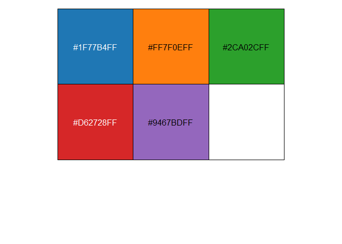
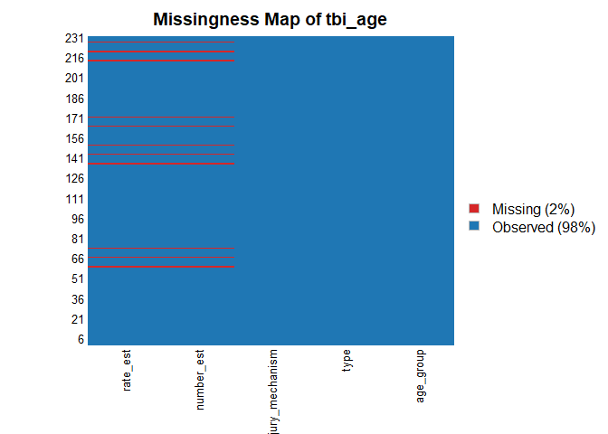
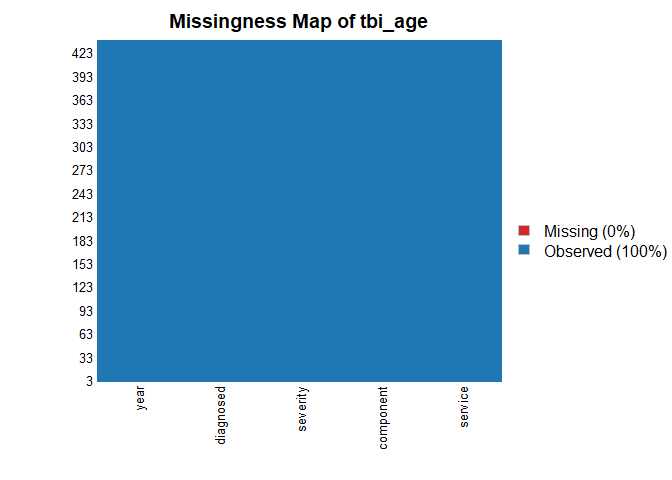
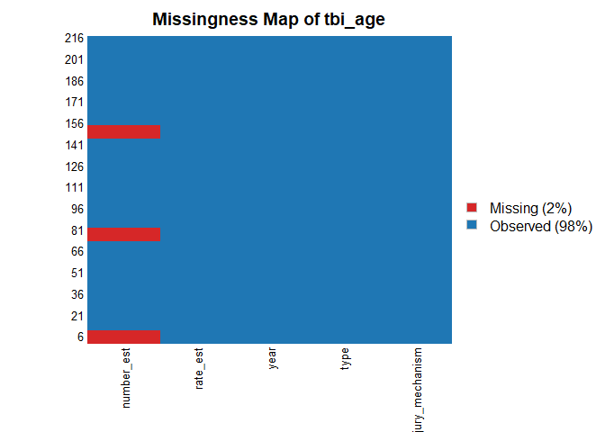
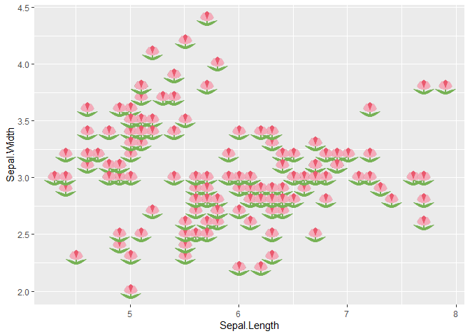
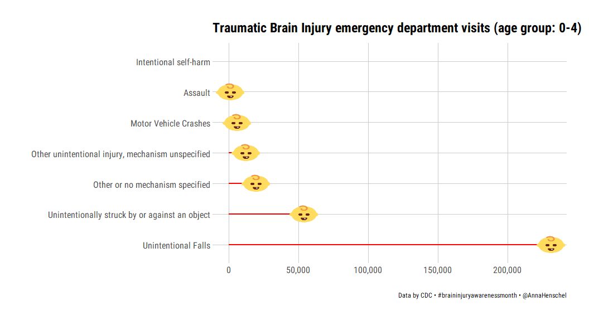
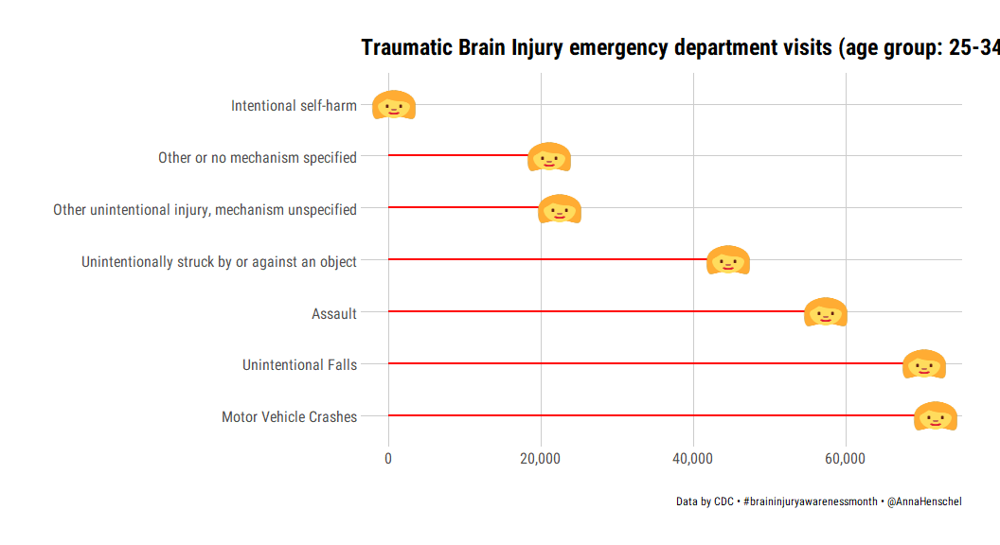
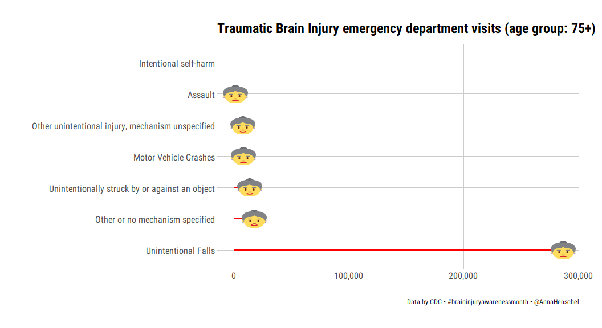

Traumatic Brain Injury
================
Anna Henschel
2020-03-24

#### Submission for \#TidyTuesday week 13 “Traumatic Brain Injury” 🧠

From the Tidy Tuesday
[repo](https://github.com/rfordatascience/tidytuesday/tree/master/data/2020/2020-03-24):

"The goal of this week’s \#TidyTuesday is to spread awareness for just
how common TBIs are - both in civilian and military populations. **One
of every 60 people in the U.S. lives with a TBI related disability.
Moderate and severe traumatic brain injury (TBI) can lead to a lifetime
of physical, cognitive, emotional, and behavioral changes.**

If you want to share an infographic or summary graphic from this data -
please consider using the awareness hashtag: \#ChangeYourMind,
\#braininjuryawarenessmonth, or tagging the Brain Injury Association.
More details can be found at the Brain Injury Association Website.

The data this week comes from the CDC and Veterans Brain Injury Center.
Additional stats can be found at CDC.gov."

``` r
library(hrbrthemes)
library(ggsci)
library(scales)
library(extrafont)
library(patchwork)
library(emo)
library(Amelia)
library(tidyverse)
library(emoGG)
```

#### Load the data 📊

``` r
# Get the Data
tbi_age <- readr::read_csv('https://raw.githubusercontent.com/rfordatascience/tidytuesday/master/data/2020/2020-03-24/tbi_age.csv')
tbi_year <- readr::read_csv('https://raw.githubusercontent.com/rfordatascience/tidytuesday/master/data/2020/2020-03-24/tbi_year.csv')
tbi_military <- readr::read_csv('https://raw.githubusercontent.com/rfordatascience/tidytuesday/master/data/2020/2020-03-24/tbi_military.csv')
```

Exploring the data a bit (missingness etc):

``` r
glimpse(tbi_age)
```

    ## Observations: 231
    ## Variables: 5
    ## $ age_group        <chr> "0-17", "0-17", "0-17", "0-17", "0-17", "0-17", "0...
    ## $ type             <chr> "Emergency Department Visit", "Emergency Departmen...
    ## $ injury_mechanism <chr> "Motor Vehicle Crashes", "Unintentional Falls", "U...
    ## $ number_est       <dbl> 47138, 397190, 229236, 55785, NA, 24360, 57983, 54...
    ## $ rate_est         <dbl> 64.1, 539.8, 311.6, 75.8, NA, 33.1, 78.8, 27.5, 11...

``` r
mypal = pal_d3("category10")(5) # pick 5 colours from color palette
scales::show_col(mypal)
```

<!-- -->

``` r
Amelia::missmap(tbi_age, 
                col = c("#D62728FF", "#1F77B4FF"), 
                main = "Missingness Map of tbi_age")
```

    ## Warning: Unknown or uninitialised column: 'arguments'.
    
    ## Warning: Unknown or uninitialised column: 'arguments'.

    ## Warning: Unknown or uninitialised column: 'imputations'.

<!-- -->

``` r
Amelia::missmap(tbi_military, 
                col = c("#D62728FF", "#1F77B4FF"), 
                main = "Missingness Map of tbi_age")
```

    ## Warning: Unknown or uninitialised column: 'arguments'.

    ## Warning: Unknown or uninitialised column: 'arguments'.

    ## Warning: Unknown or uninitialised column: 'imputations'.

<!-- -->

``` r
Amelia::missmap(tbi_year, 
                col = c("#D62728FF", "#1F77B4FF"), 
                main = "Missingness Map of tbi_age")
```

    ## Warning: Unknown or uninitialised column: 'arguments'.

    ## Warning: Unknown or uninitialised column: 'arguments'.

    ## Warning: Unknown or uninitialised column: 'imputations'.

<!-- -->

#### Explore {emoGG} package 😄

``` r
# How does {emoGG} work?
emoji_search("tulip")
```

    ##              emoji             code keyword
    ## 1929         tulip            1f337 flowers
    ## 1930         tulip            1f337   plant
    ## 1931         tulip            1f337  nature
    ## 1932         tulip            1f337  summer
    ## 1933         tulip            1f337  spring
    ## 4595     copyright               a9      ip
    ## 5538 liechtenstein 1f1f1\\U0001f1ee      li

``` r
# Plot with geom_emoji
ggplot(iris, aes(Sepal.Length, Sepal.Width, color = Species)) +
  geom_emoji(emoji="1f337") 
```

<!-- -->

``` r
# Search codes for brain
# emoji_search("brain")
# emoji_search("bandage")
# emoji_search("bulb")
# emoji_search("baby")
# emoji_search("woman")
# emoji_search("old")
```

Relevant emojis: `emo::ji("hospital")` = 🏥, `emo::ji("ambulance")` = 🚑,
`emo::ji("doctor")` = 🏥

How to use {emoGG}:  
<https://blog.revolutionanalytics.com/2015/11/emojis-in-ggplot-graphics.html>

#### Plot the TBI data 📈

``` r
p1 <- tbi_age %>%
  filter(age_group == "0-4") %>%
  filter(type == "Emergency Department Visit") %>%
ggplot(aes(number_est, reorder(injury_mechanism, -number_est))) +
  geom_segment(aes(x = 0, y = reorder(injury_mechanism, -number_est), xend = number_est, yend = reorder(injury_mechanism, -number_est)), color = "red", size = 1) +
  geom_emoji(emoji = "1f476", size = .08) +
  scale_x_continuous(label=comma) +
  hrbrthemes::theme_ipsum_rc(grid="XY") +
  theme(axis.text.x = element_text(size =12),
        axis.text.y = element_text(size =12)) +
  labs(x = '',
       y = '',
       title = 'Traumatic Brain Injury emergency department visits (age group: 0-4)', 
       caption = 'Data by CDC • #braininjuryawarenessmonth • @AnnaHenschel')

p1
```

    ## Warning: Removed 1 rows containing missing values (geom_segment).

    ## Warning: Removed 1 rows containing missing values (geom_emoji).

<!-- -->

``` r
p2 <- tbi_age %>%
  filter(age_group == "25-34") %>%
  filter(type == "Emergency Department Visit") %>%
ggplot(aes(number_est, reorder(injury_mechanism, -number_est))) +
  geom_segment(aes(x = 0, y = reorder(injury_mechanism, -number_est), xend = number_est, yend = reorder(injury_mechanism, -number_est)), color = "red", size = 1) +
  geom_emoji(emoji = "1f469", size = .08) +
  scale_x_continuous(label=comma) +
  hrbrthemes::theme_ipsum_rc(grid="XY") +
  theme(axis.text.x = element_text(size =12),
        axis.text.y = element_text(size =12)) +
  labs(x = '',
       y = '',
       title = 'Traumatic Brain Injury emergency department visits (age group: 25-34)', 
       caption = 'Data by CDC • #braininjuryawarenessmonth • @AnnaHenschel')
p2
```

<!-- -->

``` r
p3 <- tbi_age %>%
  filter(age_group == "75+") %>%
  filter(type == "Emergency Department Visit") %>%
ggplot(aes(number_est, reorder(injury_mechanism, -number_est))) +
   geom_segment(aes(x = 0, y = reorder(injury_mechanism, -number_est), xend = number_est, yend = reorder(injury_mechanism, -number_est)), color = "red", size = 1) +
  geom_emoji(emoji = "1f475", size = .08) +
  scale_x_continuous(label=comma) +
  hrbrthemes::theme_ipsum_rc(grid="XY") +
  theme(axis.text.x = element_text(size =12),
        axis.text.y = element_text(size =12)) +
  labs(x = '',
       y = '',
       title = 'Traumatic Brain Injury emergency department visits (age group: 75+)', 
       caption = 'Data by CDC • #braininjuryawarenessmonth • @AnnaHenschel')
p3
```

    ## Warning: Removed 1 rows containing missing values (geom_segment).

    ## Warning: Removed 1 rows containing missing values (geom_emoji).

<!-- -->

💡Remember to tag: @biaamerica when sharing infographic\!
