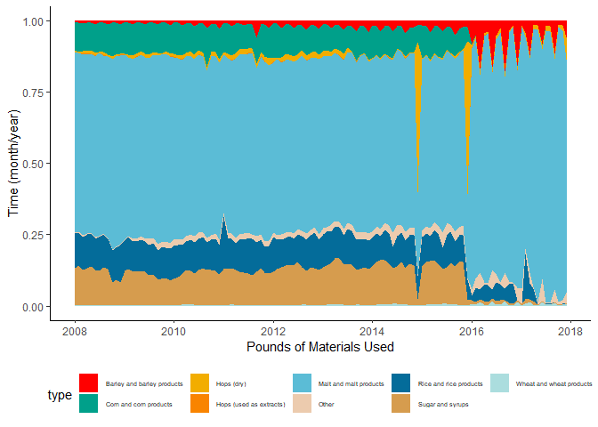
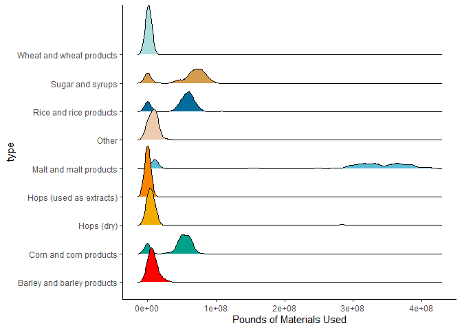
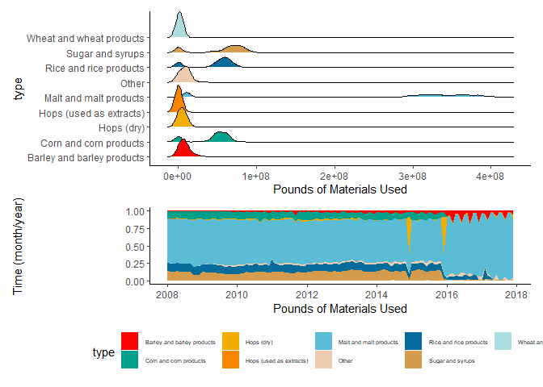

Beer Production
================
Anna Henschel
2020-03-31

#### Submission for \#TidyTuesday week 14 “Beer Production” 🍺

Recreating the plots of
[esogin](https://github.com/esogin/tidy/blob/master/tuesdays/beer/beer%20production.Rmd)

``` r
library(ggplot2)
library(tidyr)
library(dplyr)
```

    ## 
    ## Attaching package: 'dplyr'

    ## The following objects are masked from 'package:stats':
    ## 
    ##     filter, lag

    ## The following objects are masked from 'package:base':
    ## 
    ##     intersect, setdiff, setequal, union

``` r
library(patchwork)
library(lubridate)
```

    ## 
    ## Attaching package: 'lubridate'

    ## The following object is masked from 'package:base':
    ## 
    ##     date

``` r
library(hrbrthemes)
library(wesanderson)
library(ggridges)
```

load data

``` r
brewing_materials <- readr::read_csv('https://raw.githubusercontent.com/rfordatascience/tidytuesday/master/data/2020/2020-03-31/brewing_materials.csv')
```

    ## Parsed with column specification:
    ## cols(
    ##   data_type = col_character(),
    ##   material_type = col_character(),
    ##   year = col_double(),
    ##   month = col_double(),
    ##   type = col_character(),
    ##   month_current = col_double(),
    ##   month_prior_year = col_double(),
    ##   ytd_current = col_double(),
    ##   ytd_prior_year = col_double()
    ## )

``` r
head(brewing_materials)
```

    ## # A tibble: 6 x 9
    ##   data_type material_type  year month type  month_current month_prior_year
    ##   <chr>     <chr>         <dbl> <dbl> <chr>         <dbl>            <dbl>
    ## 1 Pounds o~ Grain Produc~  2008     1 Malt~     374165152        365300134
    ## 2 Pounds o~ Grain Produc~  2008     1 Corn~      57563519         41647092
    ## 3 Pounds o~ Grain Produc~  2008     1 Rice~      72402143         81050102
    ## 4 Pounds o~ Grain Produc~  2008     1 Barl~       3800844          2362162
    ## 5 Pounds o~ Grain Produc~  2008     1 Whea~       1177186          1195381
    ## 6 Pounds o~ Total Grain ~  2008     1 Tota~     509108844        491554871
    ## # ... with 2 more variables: ytd_current <dbl>, ytd_prior_year <dbl>

``` r
unique(brewing_materials$data_type)
```

    ## [1] "Pounds of Materials Used"

``` r
type1<-brewing_materials %>% 
    mutate(year_month=make_datetime(year,month)) %>% 
    select(year_month,type,month_current) %>%
    filter(!type %in% c('Total Used','Total Grain products','Total Non-Grain products')) %>% 
    ggplot(aes(x=year_month,y=month_current,fill=type))+  geom_density(color=NA,stat='identity',position="fill") + theme_classic() + scale_fill_manual(values=c(wes_palette("Darjeeling1"),wes_palette("Darjeeling2")))  + 
  xlab('Pounds of Materials Used') +  
  ylab('Time (month/year)') +  
  theme(legend.position ='bottom',legend.text = element_text(size=5))
type1
```

<!-- -->

``` r
type2<-brewing_materials %>% 
    mutate(year_month=make_datetime(year,month)) %>% 
    select(year_month,type,month_current) %>%
    filter(!type %in% c('Total Used','Total Grain products','Total Non-Grain products')) %>% 
  ggplot(aes(x=month_current,y=type,fill=type)) + geom_density_ridges()+ 
  theme_classic() + scale_fill_manual(values=c(wes_palette("Darjeeling1"),wes_palette("Darjeeling2")))+ 
  xlab('Pounds of Materials Used') + 
  guides(fill=F)
type2
```

    ## Picking joint bandwidth of 4670000

<!-- -->

``` r
type2 / type1 + 
  plot_layout(heights = c(2,1)) + 

ggsave('Beer_brewing.pdf',height=5,width=8)
```

    ## Picking joint bandwidth of 4670000
    ## Picking joint bandwidth of 4670000

<!-- -->
