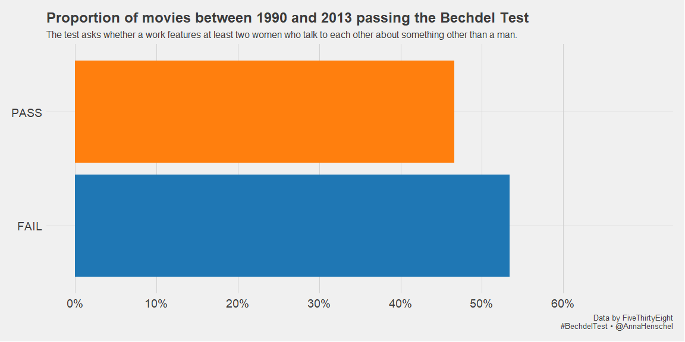
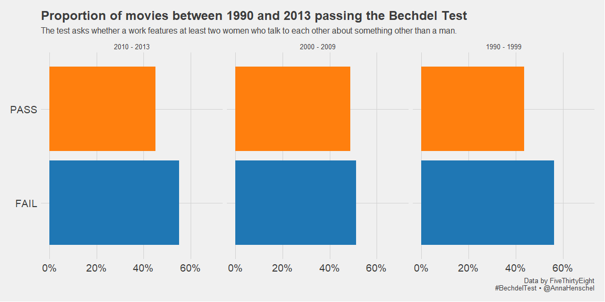
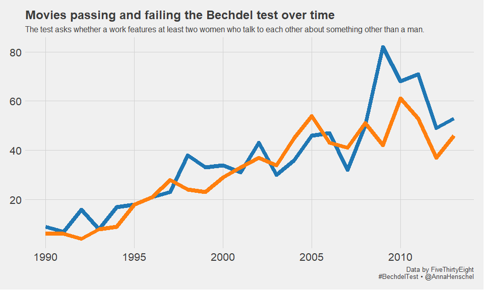
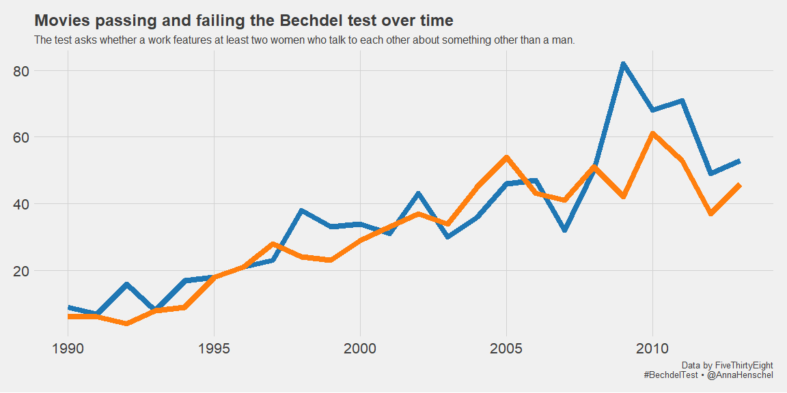
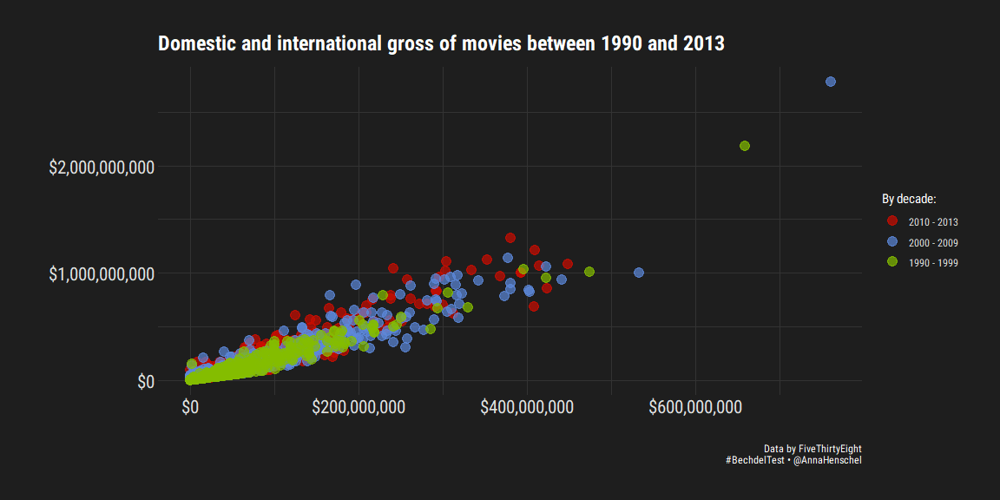

FiveThirtyEight Bechdel Data
================
Anna Henschel

## Bechdel data

Inspired by the following vignette by Chester Ismay:
<https://fivethirtyeight-r.netlify.com/articles/bechdel.html>.

Load libraries

``` r
# Bechdel data from fivethirtyeight 
library(fivethirtyeight)
# color palettes with a lot of flexibility
library(ggsci)
# pretty ggplot themes
library(ggthemes)
# more pretty ggplot themes
library(hrbrthemes)
# get more fonts
library(extrafont)
# aggregate frequencies of factors
library(janitor)
# variety of methods for reshaping data prior to analysis
library(reshape2)
 # tidy data wrangling
library(tidyverse)
# Turn off scientific notation
options(scipen = 99)
```

Load data

``` r
# get data included in the fivethirtyeight package
data(bechdel) 

# peak at data
glimpse(bechdel)
```

    ## Observations: 1,794
    ## Variables: 15
    ## $ year          <int> 2013, 2012, 2013, 2013, 2013, 2013, 2013, 2013, 2013,...
    ## $ imdb          <chr> "tt1711425", "tt1343727", "tt2024544", "tt1272878", "...
    ## $ title         <chr> "21 & Over", "Dredd 3D", "12 Years a Slave", "2 Guns"...
    ## $ test          <chr> "notalk", "ok-disagree", "notalk-disagree", "notalk",...
    ## $ clean_test    <ord> notalk, ok, notalk, notalk, men, men, notalk, ok, ok,...
    ## $ binary        <chr> "FAIL", "PASS", "FAIL", "FAIL", "FAIL", "FAIL", "FAIL...
    ## $ budget        <int> 13000000, 45000000, 20000000, 61000000, 40000000, 225...
    ## $ domgross      <dbl> 25682380, 13414714, 53107035, 75612460, 95020213, 383...
    ## $ intgross      <dbl> 42195766, 40868994, 158607035, 132493015, 95020213, 1...
    ## $ code          <chr> "2013FAIL", "2012PASS", "2013FAIL", "2013FAIL", "2013...
    ## $ budget_2013   <int> 13000000, 45658735, 20000000, 61000000, 40000000, 225...
    ## $ domgross_2013 <dbl> 25682380, 13611086, 53107035, 75612460, 95020213, 383...
    ## $ intgross_2013 <dbl> 42195766, 41467257, 158607035, 132493015, 95020213, 1...
    ## $ period_code   <int> 1, 1, 1, 1, 1, 1, 1, 1, 1, 1, 1, 1, 1, 1, 1, 1, 1, 1,...
    ## $ decade_code   <int> 1, 1, 1, 1, 1, 1, 1, 1, 1, 1, 1, 1, 1, 1, 1, 1, 1, 1,...

How many movies pass and fail overall vs. over time?

``` r
# Find out the overall percentage
overall_perc_bechdel <- bechdel %>%
  filter(between(year, 1990, 2013)) %>%
  tabyl(binary)

perc_decade_bechdel <- bechdel %>%
  filter(between(year, 1990, 2013)) %>%
  tabyl(binary, decade_code) %>%
  reshape::melt(id="binary") %>%
  rename(Decade = variable, 
         Count = value) %>%
  group_by(Decade) %>%
  mutate(Percentage = Count/sum(Count))


# See how this develops over years:
perc_bechdel_time <- bechdel %>%
  filter(between(year, 1990, 2013)) %>%
  tabyl(year, binary) %>%
  reshape::melt(id="year")
```

A small majority of movies fails the bechdel test:

``` r
overall_perc_bechdel %>%
  ggplot(aes(x = binary, y = percent, fill = binary)) + 
  geom_bar(stat = "identity") + 
  scale_y_continuous(labels=scales::percent, limits = c(0,.7), breaks = c(0, .1, .2, .3, .4, .5, .6)) +
  coord_flip() +
  theme_fivethirtyeight() +
  scale_fill_d3() +
  theme(legend.position = "none", 
        axis.text.x = element_text(size =14), 
        axis.text.y = element_text(size =14)) +
  labs(x = '', y = '',
         title = 'Proportion of movies between 1990 and 2013 passing the Bechdel Test', 
       subtitle = 'The test asks whether a work features at least two women who talk to each other about something other than a man.',
         caption = 'Data by FiveThirtyEight\n #BechdelTest • @AnnaHenschel') 
```

<!-- -->

What does it look like by decade?

``` r
decade_names <- c(
                    `1` = "2010 - 2013",
                    `2` = "2000 - 2009",
                    `3` = "1990 - 1999")

perc_decade_bechdel %>%
  ggplot(aes(x = binary, y = Percentage, fill = binary)) + 
  geom_bar(stat = "identity") + 
  scale_y_continuous(labels=scales::percent, limits = c(0,.7)) +
  coord_flip() +
  theme_fivethirtyeight() +
  scale_fill_d3() +
  facet_wrap(~ Decade, 
             labeller = as_labeller(decade_names)) +
  theme(legend.position = "none", 
        axis.text.x = element_text(size =14), 
        axis.text.y = element_text(size =14)) +
  labs(x = '', y = '',
         title = 'Proportion of movies between 1990 and 2013 passing the Bechdel Test', 
       subtitle = 'The test asks whether a work features at least two women who talk to each other about something other than a man.',
         caption = 'Data by FiveThirtyEight\n #BechdelTest • @AnnaHenschel') 
```

<!-- -->
It’s a bit too early to tell with this data, as the last 7 years of
the current decade are missing. But 2000 - 2009 is definitely an
improvement to 1990 -1999.

``` r
# Find out what the top international grossing movie is in each of the Bechdel Test categories
bechdel %>%
  filter(between(year, 1990, 2013)) %>%
  filter(clean_test == "ok") %>%
  select(title, binary, clean_test, intgross) %>%
  arrange(desc(intgross))
```

    ## # A tibble: 753 x 4
    ##    title                                        binary clean_test   intgross
    ##    <chr>                                        <chr>  <ord>           <dbl>
    ##  1 Titanic                                      PASS   ok         2185672302
    ##  2 Transformers: Dark of the Moon               PASS   ok         1123794076
    ##  3 Jurassic Park                                PASS   ok         1035626872
    ##  4 Alice in Wonderland                          PASS   ok         1024391110
    ##  5 Star Wars: Episode I - The Phantom Menace    PASS   ok         1007044677
    ##  6 Frozen                                       PASS   ok         1004550114
    ##  7 Harry Potter and the Sorcerer's Stone        PASS   ok          974755371
    ##  8 Despicable Me 2                              PASS   ok          970766005
    ##  9 Pirates of the Caribbean: At World's End     PASS   ok          960996492
    ## 10 Harry Potter and the Deathly Hallows: Part 1 PASS   ok          956399711
    ## # ... with 743 more rows

``` r
# Find a way to do this withot manually changing the filter!
```

How does this split up in different categories?

``` r
bechdel %>%
  filter(between(year, 1990, 2013)) %>%
  ggplot(aes(x = clean_test, fill = clean_test)) + 
  geom_bar() + 
  ylim(0,850) +
  annotate("text", x = "nowomen", y = 220, label = "For example:\n The Hobbit:\n An Unexpected Journey", alpha = .65) +
    annotate("text", x = "notalk", y = 580, label = "For example:\n Harry Potter and\n the Deathly Hallows:\n Part 2", alpha = .65) +
    annotate("text", x = "men", y = 250, label = "For example:\n Avatar", alpha = .65) +
    annotate("text", x = "dubious", y = 200, label = "For example:\n Iron Man 3", alpha = .65) +
    annotate("text", x = "ok", y = 830, label = "For example:\n Titanic", alpha = .65) +
  theme_fivethirtyeight() +
  scale_fill_d3() +
  scale_x_discrete(labels=c("nowomen" = "Less than\n 2 women", "notalk" = "At least 2 women,\n who don't talk\n to each other","men" = "At least 2 women,\n talking about men", "dubious" = "Dubious", "ok" ="At least 2 women\n who are talking to each other\n about something else\n than men")) +
  theme(legend.position = "none", 
        axis.text.x = element_text(size =14), 
        axis.text.y = element_text(size =14)) +
  labs(x = '', y = '',
         title = 'Movies between 1990 and 2013 by Bechdel Test category', 
       subtitle = 'The test asks whether a work features at least two women who talk to each other about something other than a man.\nFor each category, an example of the highest international grossing movie is given.',
         caption = 'Data by FiveThirtyEight\n #BechdelTest • @AnnaHenschel') 
```

<!-- -->

Does this change over time?

``` r
ggplot(perc_bechdel_time,
       aes(x = year, y = value, colour = variable)) +
       geom_line(size = 3) +
  theme_fivethirtyeight() +
  scale_colour_d3() +
  theme(legend.position = "none", 
        axis.text.x = element_text(size =16), 
        axis.text.y = element_text(size =16)) +
  labs(x = '', y = '',
         title = 'Movies passing and failing the Bechdel test over time', 
       subtitle = 'The test asks whether a work features at least two women who talk to each other about something other than a man.',
         caption = 'Data by FiveThirtyEight\n #BechdelTest • @AnnaHenschel') 
```

<!-- -->

Does domestic and international gross correlate?

``` r
bechdel$decade_code <- factor(bechdel$decade_code, labels=c("2010 - 2013", "2000 - 2009", "1990 - 1999"))

import_roboto_condensed()
```

    ## You will likely need to install these fonts on your system as well.
    ## 
    ## You can find them in [C:/Users/Anna/Documents/R/win-library/3.6/hrbrthemes/fonts/roboto-condensed]

``` r
bechdel %>%
  filter(between(year, 1990, 2013)) %>%
  ggplot(aes(x = domgross, y = intgross, colour = as_factor(decade_code))) + 
  geom_jitter(alpha = .7, size = 4) +
  scale_x_continuous(labels = scales::dollar_format(prefix="$")) +
  scale_y_continuous(labels = scales::dollar_format(prefix="$")) +
  hrbrthemes::theme_modern_rc() +
  scale_color_startrek() +
  theme(axis.text.x = element_text(size =16), 
        axis.text.y = element_text(size =16)) +
  labs(x = '', y = '',
       colour = "By decade:", 
         title = 'Domestic and international gross of movies between 1990 and 2013',
       caption = 'Data by FiveThirtyEight\n #BechdelTest • @AnnaHenschel') 
```

    ## Warning: Removed 14 rows containing missing values (geom_point).

<!-- -->

Domestic gross and international gross for each movie seems highly
correlated in each decade.
